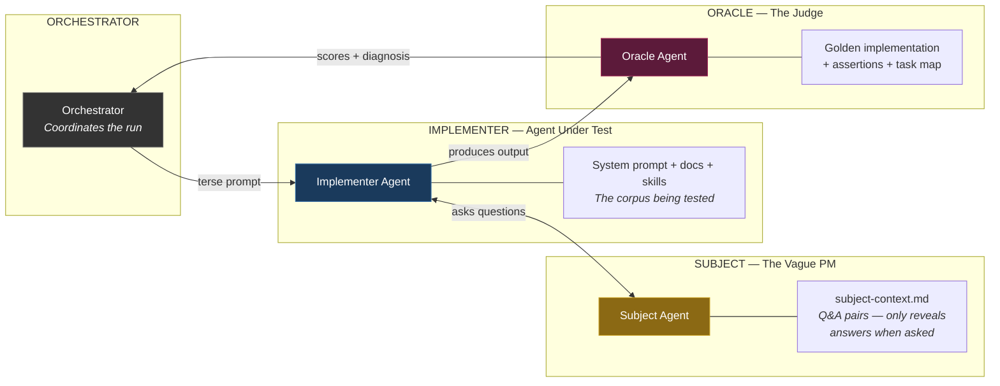
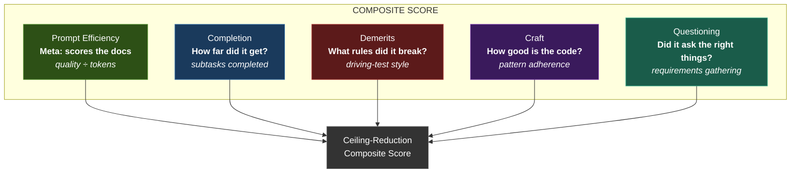
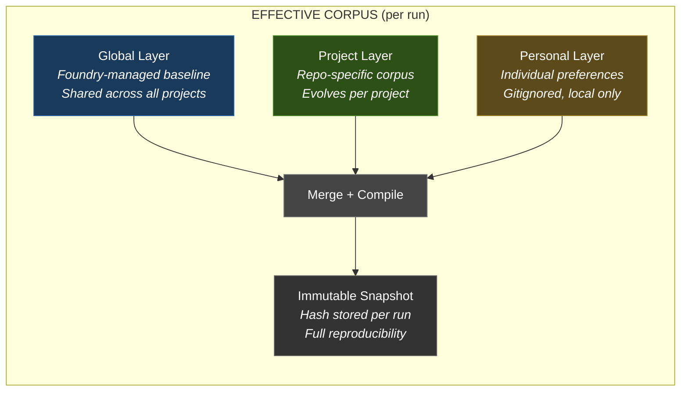
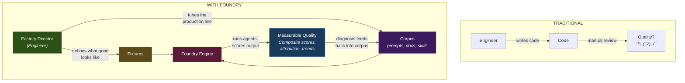
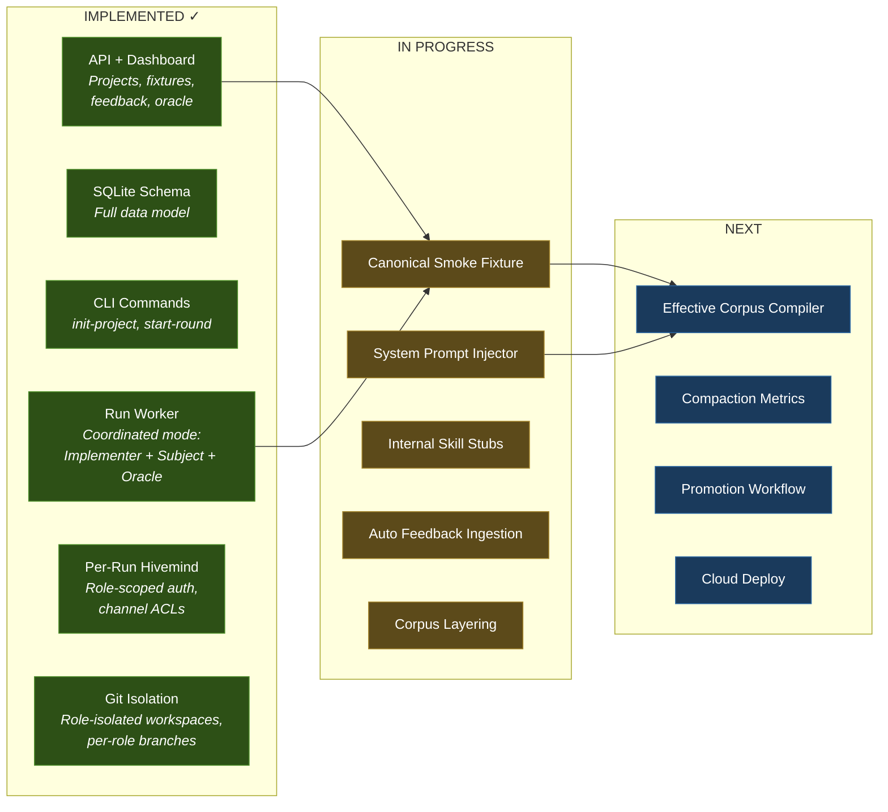

# Foundry Architecture

> Implementation details for the [Foundry vision](./PROPOSAL.md).

---

## How It Works: Three Agents, Three Perspectives

| Agent | Role | Sees | Key Signal |
|-------|------|------|------------|
| **Subject** | Vague PM | Domain knowledge (Q&A pairs) | Doesn't volunteer info — only answers when asked |
| **Implementer** | Agent under test | Clean codebase + the corpus being evaluated | Produces the work output |
| **Oracle** | Judge | Golden implementation + rubrics | Scores output, diagnoses root causes |

**Physical isolation via git branches** — each agent sees only its branch. No credential tricks, no instruction-based scoping. The Implementer can't peek at the golden answer.

---

## The Five Scoring Rubrics

**Prompt Efficiency is the meta-score** — it measures the docs, not the agent. If two doc variants produce the same quality output but one uses 3x fewer tokens, the shorter one scores 3x better. This creates constant pressure to make docs concise and modular.

---

## The Corpus Architecture: Three Layers

Each layer contains: **system prompt + docs + rules + skills**

Every run compiles these into an immutable snapshot with a content hash — so you can reproduce any run exactly and attribute score changes to specific corpus modifications.

---

## The Factory Director Metaphor

**The engineer's job shifts** from writing code to defining quality standards and tuning the system that produces code. Each improvement compounds — one person's better skill or doc benefits every future agent session across the entire team.

---

## What's Built Today

