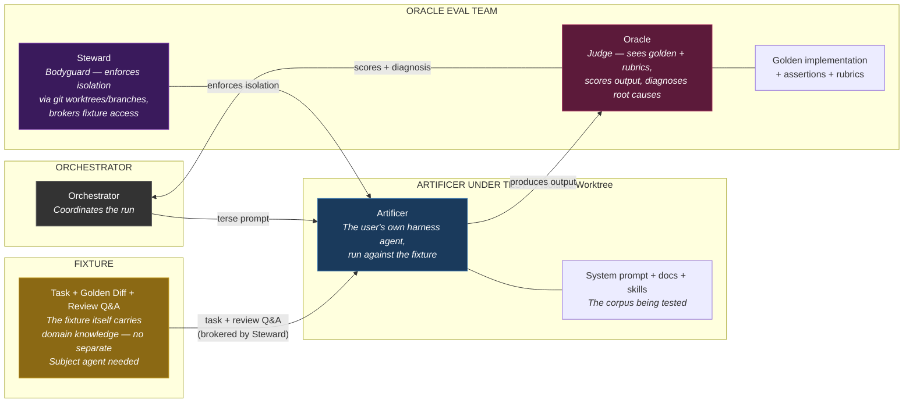
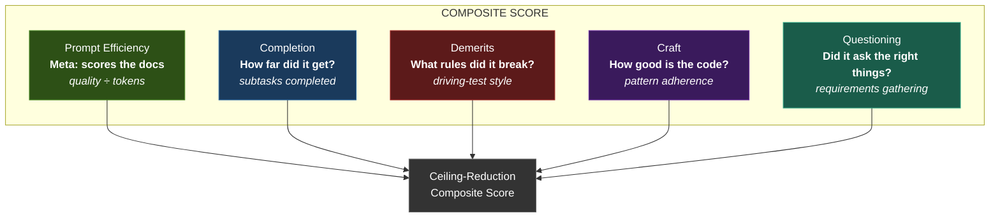
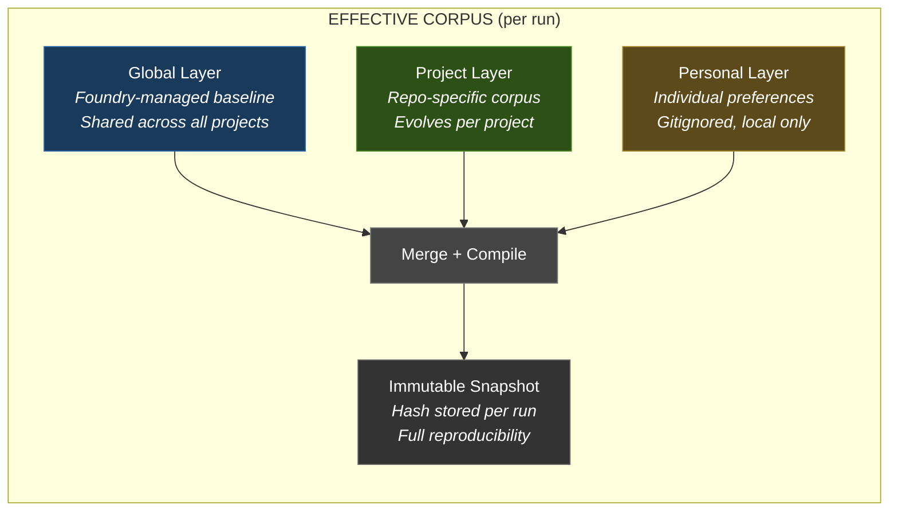
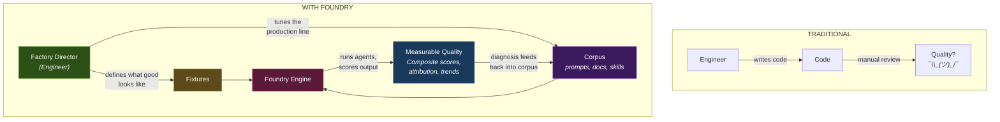
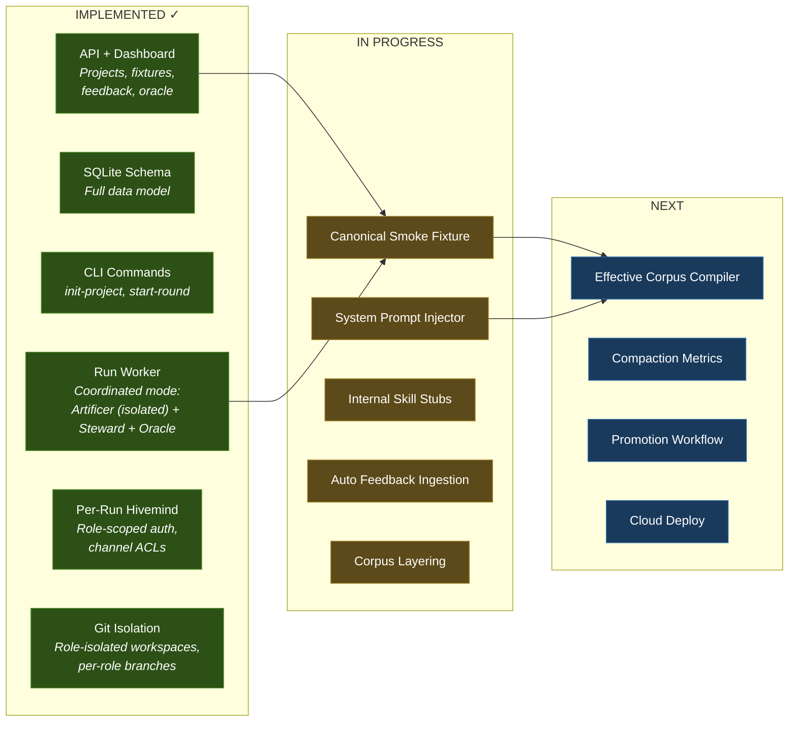

# Foundry Architecture

> Implementation details for the [Foundry vision](./PROPOSAL.md).

---

## How It Works: Oracle Eval Team + Isolated Artificer

| Agent | Role | Sees | Key Signal |
|-------|------|------|------------|
| **Artificer (under test)** | The user's own harness agent, running in an isolated worktree | Clean codebase + the corpus being evaluated | Produces the work output |
| **Steward** | Bodyguard / integrity-enforcer for the Oracle team | Fixture metadata + isolation topology | Prevents the Artificer from peeking at the golden; enforces chain-of-custody |
| **Oracle** | Judge | Golden implementation + rubrics | Scores output, diagnoses root causes |

The agent-under-test is the user's own **Artificer** — the Oracle team doesn't own one; it just spins one up against the fixture.

**Physical isolation via git worktrees/branches** — the Steward enforces that each agent sees only its branch. No credential tricks, no instruction-based scoping. The Artificer can't peek at the golden answer.

---

## The Five Scoring Rubrics

**Prompt Efficiency is the meta-score** — it measures the docs, not the agent. If two doc variants produce the same quality output but one uses 3x fewer tokens, the shorter one scores 3x better. This creates constant pressure to make docs concise and modular.

---

## The Corpus Architecture: Three Layers

Each layer contains: **system prompt + docs + rules + skills**

Every run compiles these into an immutable snapshot with a content hash — so you can reproduce any run exactly and attribute score changes to specific corpus modifications.

---

## The Factory Director Metaphor

**The engineer's job shifts** from writing code to defining quality standards and tuning the system that produces code. Each improvement compounds — one person's better skill or doc benefits every future agent session across the entire team.

---

## What's Built Today

---

## Primitive Coverage for Agent Roles

| Defined Role | Primitive | Status |
|-------------|-----------|--------|
| Artificer (executor / agent under test) | Executor — takes context + payload, produces output | Ready |
| Oracle (judge) | LLMScorer + HeuristicDiagnoser + LLMDiagnoser | Ready |
| Steward (isolation / fixture broker for Oracle evals) | Worktree/branch isolation + fixture chain-of-custody | Planned |
| The Cartographer | Router with full context visibility + contextSlice | Ready |
| The Librarian (signal reconciliation) | Classifier → Router pipeline (Harness classify→route) | Ready |
| Wardens (advise + guard per domain) | Decider<boolean> per concern (conventions, security, etc.) | Primitive ready, config-driven instances live |
| Herald (cross-agent observation) | Herald class with 5 PatternDetectors | Ready |
| Artificer execution layer (per-domain context slicing) | Executor with LayerFilter per context slice | Ready |
| Planner (plan mode) | Planner agent + planModeHook auto-shunt | Ready |

---

## New Primitives (Since Initial Architecture)

- **Herald** — cross-agent observation with snapshot-based coordination. 5 detectors: duplication, contradiction, convergence, cross-pollination, resource imbalance. Operates on frozen ThreadSnapshots, stateless, read-many write-none.
- **Corpus Compiler** — Three-stage pipeline: fluid entries (raw signals) → formal docs (conventions, ADRs, skills with lifecycle states) → compiled corpus (immutable, hashed, token-optimized). Supports tier promotion: personal → team → org.
- **Token Tracker** — Per-provider/model/agent cost accounting with budget enforcement and analytics.
- **Lifecycle Hooks** — 16 hook points (pre/post dispatch, classify, route, session events, budget events, plan mode). Built-in hooks: planModeHook, budgetGuardHook.
- **Streaming** — AsyncGenerator<LLMStreamEvent> for Anthropic, OpenAI, Gemini providers.
- **Analytics** — First-class cost tracking with time-series rollups, thread costs, model rankings.
- **Planner Agent** — Generates execution plans with dependency-ordered steps, dispatches to agents, tracks results.

---

## Three-System Split

- The codebase is designed for eventual split into: @foundry/primitives (open), Foundry (opinionated), Foundry Oracle (service)
- See docs/THREE_SYSTEMS.md for full details
- Dependencies are already unidirectional: primitives ← foundry ← oracle
