# Foundry

> **Gradient descent on documentation** — because you can't do gradient descent on the model.

---

## The Topology of Modern AI Work

There are three layers to AI-assisted work. Two are getting massive investment. One is not.

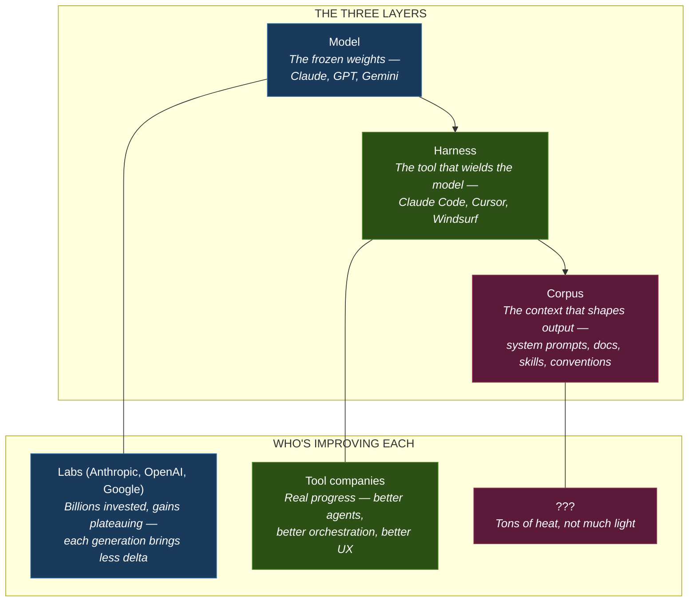

**Model improvements are plateauing.** Labs are spending billions and each generation brings diminishing returns. The step change from GPT-3 to GPT-4 was transformative. The step change from GPT-4 to GPT-5 is incremental.

**Harness improvements are real but generic.** Claude Code, Cursor, Windsurf — these tools are getting dramatically better at wielding models. But they're general-purpose. They don't know your org's conventions, your team's taste, or the lessons you learned last sprint.

**Corpus is where the actual leverage is — and it's a mess.** People are seeing real gains from better prompts, better docs, better skills. But it's artisanal. No standardized skill libraries to start from. No infrastructure for capturing what happens during real work and feeding it back. No way to measure whether a corpus change actually made things better or just felt like it did. Everyone's hand-rolling their CLAUDE.md and hoping for the best.

**In fact, there's growing evidence that most corpus is doing more harm than good.** Research on LLM attention (Liu et al., 2023) shows 30%+ performance degradation when relevant information gets buried in long context. Bloated rules files create exactly this problem. Stale instructions written for older workflows don't fail loudly — they quietly degrade output. Teams pile on rules and see quality drop, not rise. One study found AI-assisted productivity gains averaging just 10–15%, far below the 50% touted — with time saved on boilerplate wiped out reviewing and fixing degraded output. Without measurement, you can't tell if your corpus is helping or hurting. Most people can't. And most people's isn't.

**Foundry is the infrastructure layer for corpus.** Three things that don't exist yet:

1. **Standardized primitives** — a base set of skills, docs, and conventions that work out of the box, so you're not starting from zero
2. **Event capture** — infrastructure for recording, tagging, and classifying everything that happens during normal work — every correction, every question, every redirect
3. **The recursion loop** — a system that turns those captured signals into corpus improvements automatically, measures whether they worked, and rolls them back if they didn't

**Foundry treats corpus as the parameters to optimize — and provides the infrastructure to do it systematically.**

---

## The Vision: A Recursive Improvement Engine

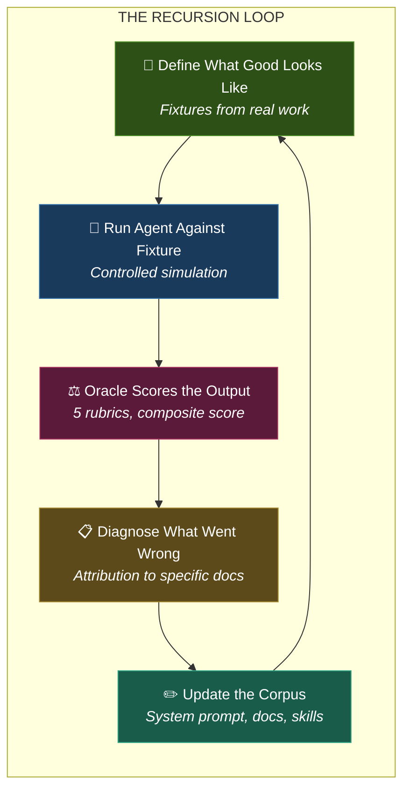

**Each loop makes the system smarter.** Not just the current output — the entire corpus that every future agent session draws from.

---

## How It Works: Three Agents, Three Perspectives

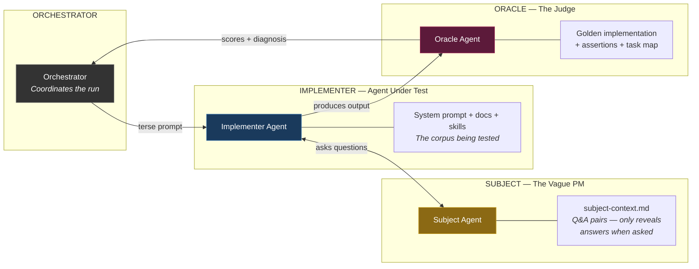

| Agent | Role | Sees | Key Signal |
|-------|------|------|------------|
| **Subject** | Vague PM | Domain knowledge (Q&A pairs) | Doesn't volunteer info — only answers when asked |
| **Implementer** | Agent under test | Clean codebase + the corpus being evaluated | Produces the work output |
| **Oracle** | Judge | Golden implementation + rubrics | Scores output, diagnoses root causes |

**Physical isolation via git branches** — each agent sees only its branch. No credential tricks, no instruction-based scoping. The Implementer can't peek at the golden answer.

---

## The Five Scoring Rubrics

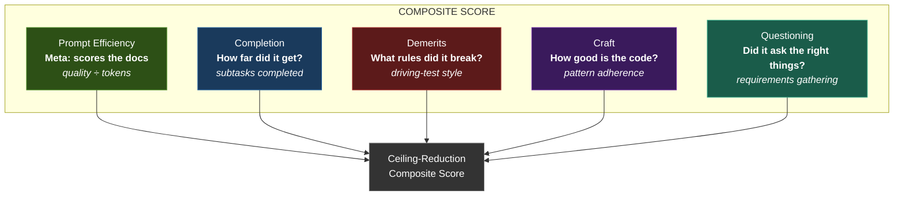

**Prompt Efficiency is the meta-score** — it measures the docs, not the agent. If two doc variants produce the same quality output but one uses 3x fewer tokens, the shorter one scores 3x better. This creates constant pressure to make docs concise and modular.

---

## The Corpus Architecture: Three Layers

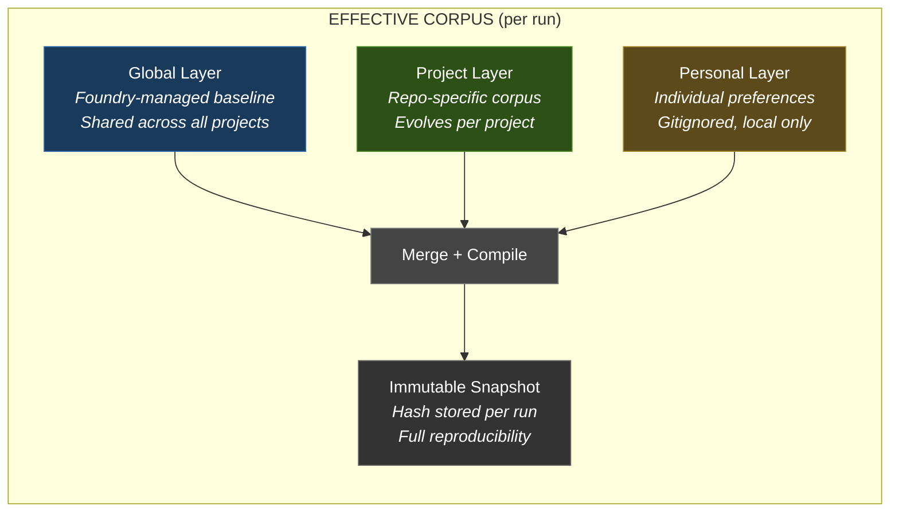

Each layer contains: **system prompt + docs + rules + skills**

Every run compiles these into an immutable snapshot with a content hash — so you can reproduce any run exactly and attribute score changes to specific corpus modifications.

---

## Where This Goes: The Unified Workspace

### The Fragmentation Problem

Today, an AI-assisted business operates across a dozen disconnected tools:

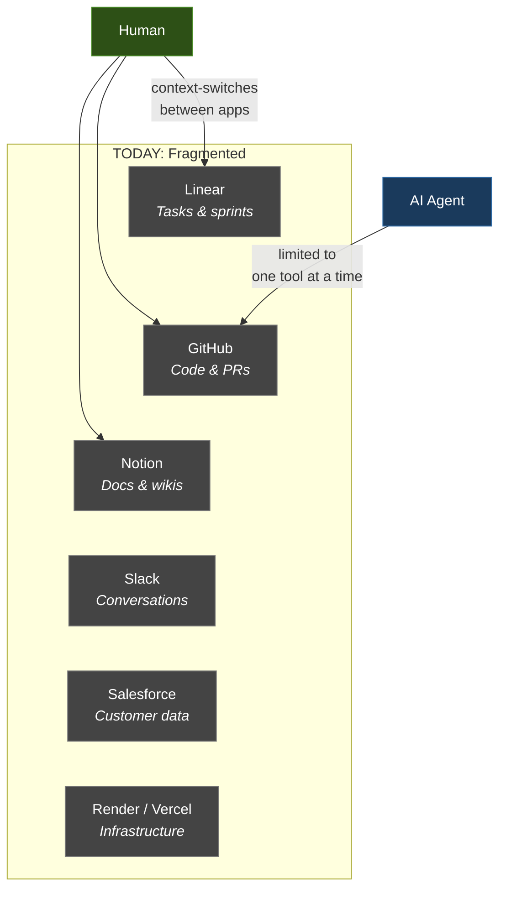

Decisions live in Slack. Tasks live in Linear. Context lives in Notion. Code lives in GitHub. Customer intent lives in Salesforce. **No single actor — human or AI — can see the full picture.** The AI agent working on a feature can't see the customer conversation that motivated it. The PM approving a spec can't see the technical constraints the agent discovered. The CX team can't see what's shipping next week.

### The Modern AI Business Lifecycle

What does a modern lifecycle actually look like when AI is a full participant?

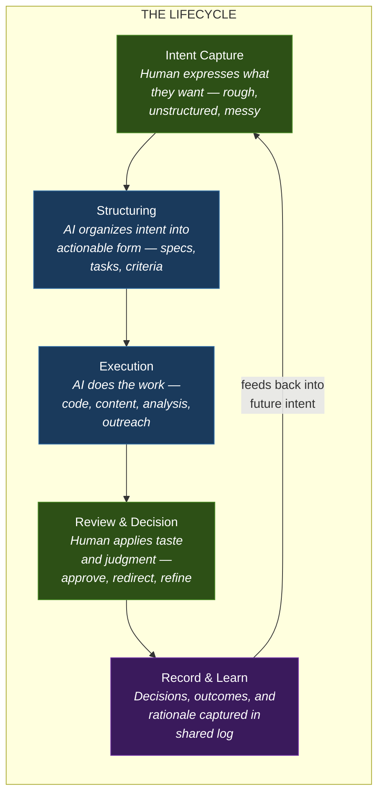

This lifecycle applies to **every function** — engineering, sales, CX, marketing, research. The content changes but the loop is the same. And critically: **both humans and AI are actors at every stage.** Humans provide intent and taste. AI provides structure and throughput. Both read and write to the same record.

### The Unified Workspace Vision

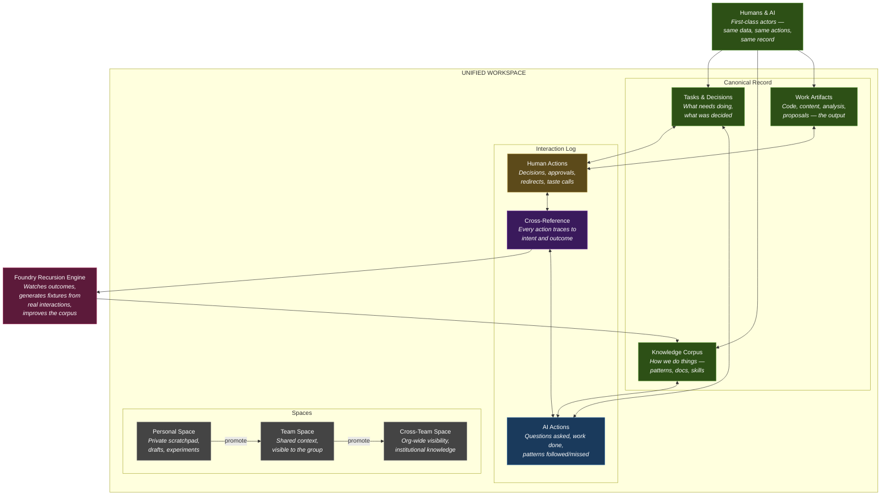

### What Makes This Different From "Just Another Platform"

The unified workspace isn't Notion + Linear + GitHub bolted together. The key differences:

**1. Humans and AI are co-equal actors.** Both can read the data, take actions, and record decisions — in the same interface, in the same log. Not "AI does things in the background and humans see a dashboard." Both operate on the same canonical record.

**2. The interaction log is the institutional memory.** Every decision, every question an AI asked, every redirect a human made — all captured, cross-referenced, and queryable. When someone new joins the team, they don't read stale wiki pages — they see the living log of how decisions were actually made.

**3. Personal and shared spaces with promotion.** You can draft something in your personal space and promote it to team-visible when it's ready. The boundary between private exploration and shared knowledge is fluid, not a wall. This mirrors how real work happens — you noodle on something privately before sharing it.

**4. Personal agents as queryable proxies.** The personal layer isn't just a config file — it's a **queryable agent** for each person and team.

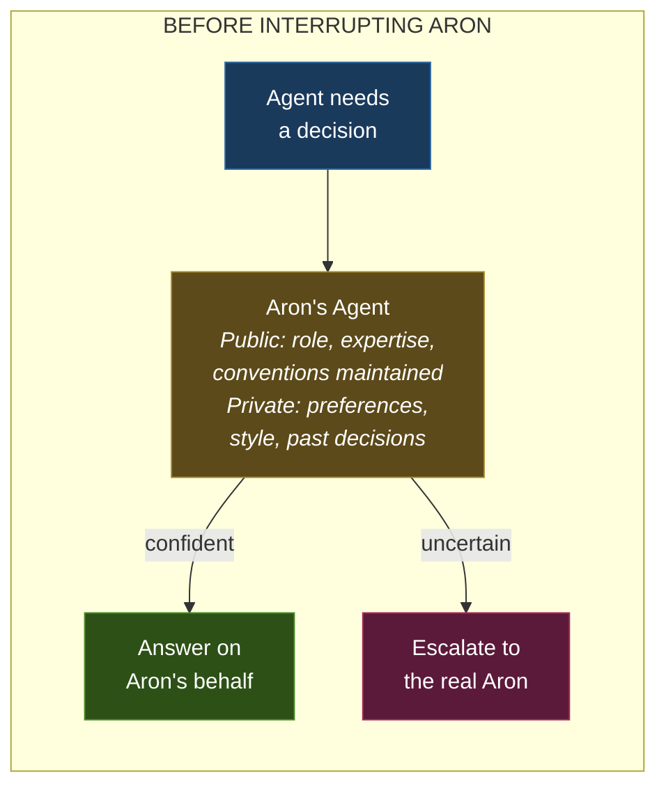

Each personal agent maintains two layers of context:

- **Public** — role, expertise areas, conventions they maintain, decisions they've made that others can reference. Visible to the team.
- **Private** — personal preferences, working style, shortcuts, opinions. Visible only to the individual. Gitignored.

The system queries your agent before querying you. Over time, as it captures your corrections and redirects, it handles more decisions autonomously — reducing interruptions while preserving your taste and judgment. Eventually, your agent doesn't just answer questions on your behalf — it acts on your behalf, carrying your taste and context into autonomous work. Privacy is built in: you control what's public and what stays private.

**5. The recursion engine sits underneath.** This is where Foundry comes in. The interaction log is a continuous stream of potential fixtures:

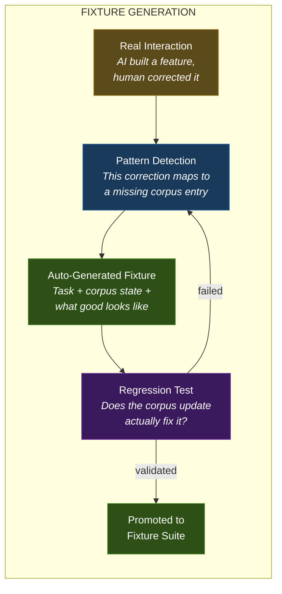

Every time a human corrects an AI, that's a signal. The system asks: "What context was missing that caused this? Can I turn this into a fixture so I catch it next time?" Over time, the fixture suite grows organically from real work — not from engineers manually authoring test cases.

### Beyond Software Engineering

The core abstraction — **task + corpus + definition of good** — is domain-agnostic:

| Domain | Task | Corpus | "Good" (Fixture) |
|--------|------|--------|-------------------|
| **Engineering** | "Add a projects endpoint" | CLAUDE.md, API docs, conventions | Golden implementation + assertions |
| **Sales** | "Draft proposal for Acme Corp" | Playbooks, case studies, pricing | Closed-won proposal that converted |
| **Customer Success** | "Respond to billing escalation" | KB articles, tone guide, policies | Response that resolved the ticket |
| **Content** | "Write launch blog post" | Brand guide, style docs, audience profiles | Published post that hit metrics |
| **Research** | "Analyze competitor pricing" | Market data, frameworks, prior analyses | Analysis that drove a decision |

In each case: the AI does the work, the human applies taste and judgment, the system records what happened, and the recursion engine asks "what would have made this better?" **The substrate doesn't matter** — git for code, a CRM for sales, a help desk for CX. Foundry provides the recursion pattern; adapters connect it to wherever the work actually lives.

### The Convergence

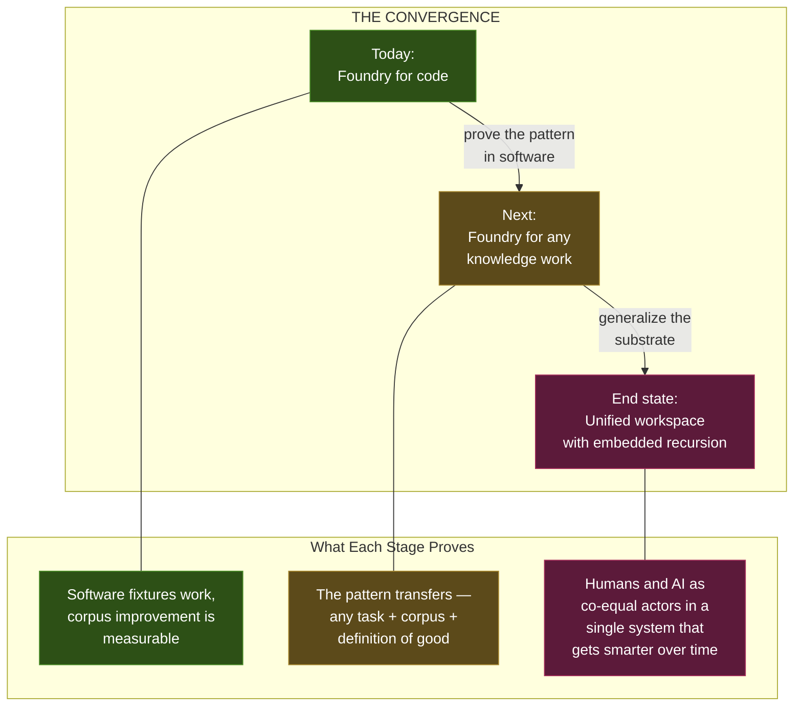

**Foundry starts as the recursion engine for code.** But the architecture is designed so that the same core — fixture-based evaluation, corpus optimization, interaction logging — can wrap around any AI-assisted workflow. The unified workspace is where it all converges: one place where humans guide taste and intent, AI does the work, both record their actions, and the system continuously improves from every interaction.

---

## What's Built Today

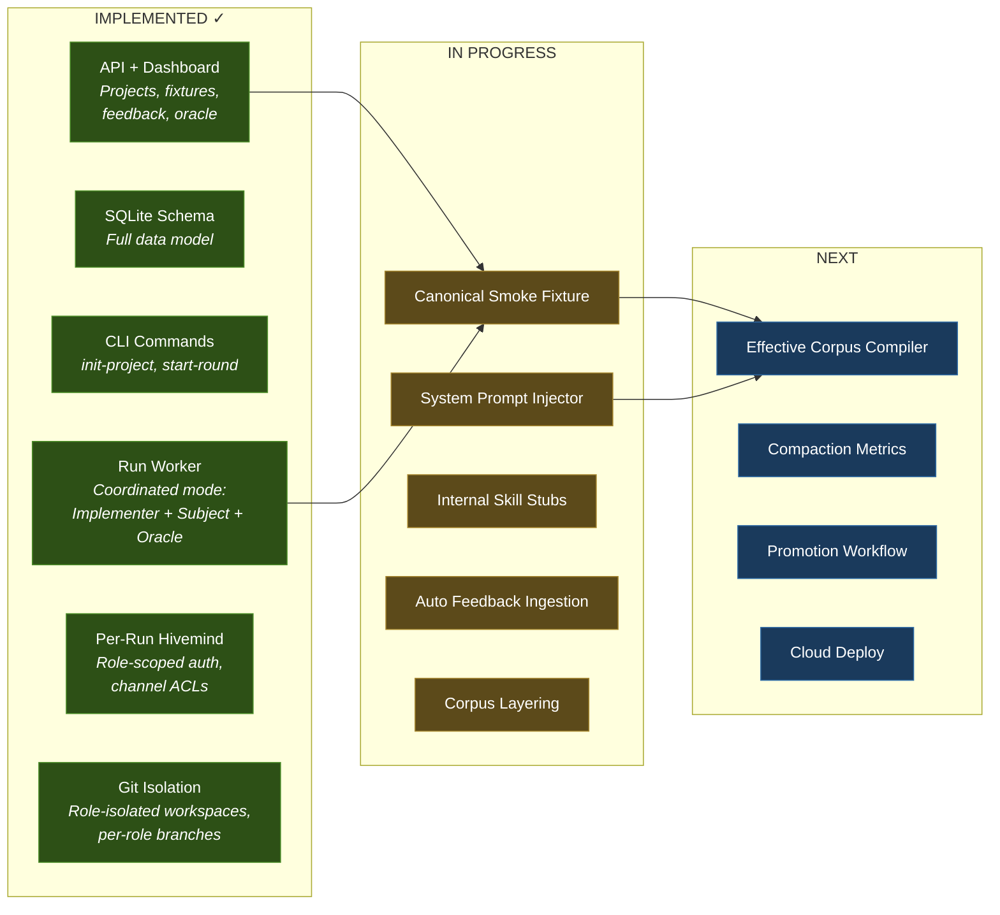

---

## The Factory Director Metaphor

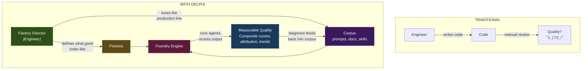

**The engineer's job shifts** from writing code to defining quality standards and tuning the system that produces code. Each improvement compounds — one person's better skill or doc benefits every future agent session across the entire team.

---

## Summary

| What | Why |
|------|-----|
| **Recursion harness** | Systematic improvement instead of vibes-based tweaking |
| **Three-agent isolation** | Honest evaluation — no information leakage |
| **Five scoring rubrics** | Multi-dimensional quality measurement with attribution |
| **Corpus layering** | Global + project + personal, with immutable snapshots |
| **Hivemind integration** | Every decision point logged for diagnosis |
| **Beyond software** | The pattern works for any task + corpus + quality definition |
| **Unified platform** | GitHub + ticketing + knowledge base + interaction log, with Foundry as the improvement engine |

> **The thesis:** The teams that systematically improve their AI context — treating prompts and docs as optimizable parameters with measurable outcomes — will dramatically outperform teams that rely on intuition. Foundry is the engine that makes that systematic improvement possible.
