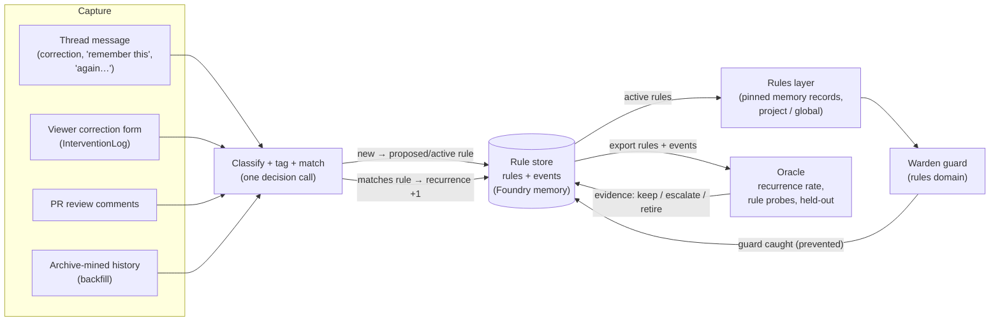

# Feedback loop

**Status: proposal.** Nothing in this document is built yet, and every design choice in it is open for Aron to decide. It is the design for [system map](SYSTEM-MAP.md) journey goal 8 ("process feedback captured into a middleware layer") and the measuring half of goal 9. Evidence comes from `origin/main` on 2026-09-30: Foundry `bc53278`, Oracle `b961afd`, Archive `ab3f173`, agent-session `320eee1`. A `path:line` is in Foundry unless it is prefixed with another repo's name.

## The point

Models get better with each release, but they don't change how they behave. Aron gives the same process feedback over and over ("merge it yourself", "use the primitive that already exists", "do not make things backwards compatible"). The thesis is that we can make behavior change last **without retraining**. The model stays the same. What changes is the context and middleware around it:

1. Feedback is captured where it is given.
2. It becomes a tagged **rule**.
3. The rule lives in a middleware layer that every relevant session receives, and that the Wardens (Foundry's per-domain checking agents) guard against.
4. Oracle measures whether the rule took.

**The metric is recurrence**: how often the same correction comes back after the rule is in place. Today this loop runs by hand. `~/code/inixiative/FEEDBACK-LOG.md` is a hand-kept table of 24 tagged rules with repeat counts, and rule 1 has recurred about 28 times even though it is written into `CLAUDE.md`. That count is evidence that putting a rule in text, on its own, is not enough. This design treats a recurrence as a failure of the layer that carries the rule. A rule that keeps failing moves up to stronger enforcement.

## 1. The loop



Each user message is checked against the existing rules **at capture time**. A match bumps that rule's counter instead of creating a new rule. Classifying, tagging and deduping happen in one step. Over the life of a rule its counter splits into four numbers:

- **seed**: occurrences before Foundry tracked the rule
- **before**: occurrences before the rule was active
- **after**: recurrences while the rule was active and in the session's context
- **caught**: violations a guard flagged before Aron had to say anything

## 2. Step by step: what exists, what's missing, the smallest change

### 2.1 Capture

**What exists**
- **The viewer correction form.** The trace drawer has a "Correction" section (`viewer/ui/detail-drawer.js:613-639`) that posts to `POST /api/interventions` (`viewer/routes/runtime.ts:623-643`). `InterventionLog.intervene` then emits a `correction` signal with confidence 1.0 (`packages/core/src/intervention.ts:67-107`). The log itself is in memory only, capped at 1000 entries (`intervention.ts:55-64`).
  - It is bound to the **main thread's** bus only: `start.ts:422` together with `start.ts:564`. A correction made on any other thread lands on the wrong thread.
- **The signal sink.** Every thread signal goes to `FileMemory.signalWriter()` (`start.ts:390`, `thread-runtime.ts:1539-1550`). The sink writes it as a memory record that the thread owns, with visibility `thread` (`packages/core/src/adapters/file-memory.ts:591-614`). `correction` is a pinned kind (`file-memory.ts:48`), so the record is injected into that one thread on every turn. It never leaves the thread.
- **Guard findings share the same signal kind.** Advisory Warden findings are emitted as `correction` too (`agents/domain-librarian.ts:953-970`). Today, guard output and human corrections are mixed together and both get pinned.
- **User messages enter in one place:** `POST /api/messages/send` (`viewer/routes/runtime.ts:514-560`). Nothing inspects them for feedback.
- **The MCP `foundry_signal` tool** has a `correction` kind, but it is refused on the native grant (`mcp/server.ts:372-394`).
- **Oracle's `oracle mine`** finds corrections in Claude Code JSONL transcripts (`oracle:src/session-miner.ts:219-272`).
  - Detection is an interrupt marker, or an opener regex like `no|don't|stop|wait|actually|instead…` (`oracle:src/session-miner.ts:216-217`).
  - It writes `{sessionId, timestamp, before, correction, signal}` (`oracle:src/session-miner.ts:31-40`) and appends the records to `.oracle/corrections.jsonl` (`oracle:src/cli.ts:218-225`).
  - It does not dedupe, does not read Codex transcripts, and does not read Archive. **No code reads the file.**
- **Archive:** Foundry captures every thread as an Archive snapshot. Entry `id` is the message id and `sessionId` is the thread id (`archives/capture.ts:6-49`). Archive has no annotation or feedback records (`archive:tickets/ARC-008-retrospective-proof.md` lists that as a future feature: "find and cite actual corrections").

**What's missing**
- Detection on the live user message.
- Detection of explicit requests ("remember this", "from now on", "always/never").
- Detection of **repeat markers**: "again", "I thought we…", "once and for all", "over and over". These are the strongest signal that a rule already exists and failed. Oracle's opener regex misses most of Aron's process feedback. Rule 25, "Again we shouldn't be doing composer", starts with neither an opener nor an interrupt.
- PR review comments.

**Smallest change**
- **Add one Foundry piece, `FeedbackCapture`** (`agents/feedback-capture.ts`). It subscribes to accepted user turns, plus `correction` signals whose `source` starts with `operator:`.
- **Run a deterministic prefilter first:** explicit phrases, repeat markers, Oracle's opener regex, and the interrupt marker. The regex goes into core as data so Foundry and Oracle share it. Only messages that pass the prefilter reach the classifier (2.2).
- **Keep it off the critical path.** It runs after the turn is accepted, in parallel with the turn, and never blocks the message.
- **Fix the InterventionLog binding.** Emit the correction on the bus of the thread the trace belongs to, not the main thread's bus.
- **Stop pinning guard findings.** Advisory guard findings get their own kind, `guard_finding`, which is listed in `auditOnlyKinds` (`file-memory.ts:49-50`). Then `correction` means a human said it.
- **Mine PR review comments offline** (phase 3). Use Oracle's existing GitHub source (`oracle:src/github-fixtures.ts:21-68`), with the thread-to-PR link coming from Archive's `github:` references (`archive:src/tags.ts:5-33`). Live review capture can wait until Kingdom's GitHub integration serves it.

### 2.2 Classify and tag

**What exists**
- `SignalKind` already names the classes: `correction | convention | taste | ci_rule | adr | security` (`packages/core/src/signal.ts:5-12`).
- Oracle's optional LLM judge adds `category: approach|scope|convention|fact|other` (`oracle:src/session-miner.ts:421-467`).
- FEEDBACK-LOG uses a 12-tag vocabulary: `hygiene naming merge reuse overbuild architecture data product coordination communication tooling security`. Its rows also use `process`, which is not in that list.
- Decision roles already run on warm subscription sessions at low priority (`providers/decision-priority.ts:3`, `subscription-policy.ts:120`).

**What's missing:** a classifier that returns a *rule*, not just a category.

**Smallest change: one decision call per candidate**, on the existing decision profile, at `review` priority.
- **Inputs:**
  - the user message
  - the previous assistant turn (bounded to the same size as the learning-review input, `domain-librarian.ts:213-218`)
  - the ids and statements of active and proposed rules in scope
- **Output** (validated JSON):
  ```
  { feedback: "none" | "process" | "convention" | "taste" | "fact",
    explicit: boolean,            // "remember this" / "from now on" / repeat marker
    match: ruleId | null,         // existing rule this restates
    statement: string,            // imperative one-liner, when new
    tags: Tag[],                  // closed list below
    scope: "project" | "global",  // classifier's suggestion
    confidence: number }
  ```
- **Tags:** the closed list is FEEDBACK-LOG's 12 tags plus `process`. It lives as an enum in code; it is not settings. `feedback: "fact"` (a task-local correction such as "the file is in src/, not lib/") is recorded as an event and never becomes a rule.
- **Why a call and not a Warden:** a Warden's advise output is fixed to `{layers, snippets, confidence}` (`domain-librarian.ts:625`), and its learning review writes thread-private text (`ThreadKnowledge`, `domain-librarian.ts:234-310`). Neither returns a structured rule. So a new prompt and parser are unavoidable. They are small and use the same provider and priority machinery.

### 2.3 Dedupe into a rule with a recurrence counter

**What exists**
- `CorpusCompiler.ingest` dedupes only on exact content plus source (`agents/corpus-compiler.ts:137-145`). `autoPromote` groups by signal *kind*, so every correction lands in one blob (`corpus-compiler.ts:199-249`).
- Oracle's `gaps` and `suggestions` count exact strings (`oracle:src/store.ts:323-411`).
- Nothing counts the same correction recurring.

**What's missing:** rule identity, plus a counter attached to evidence.

**Smallest change:** the classifier's `match` field *is* the dedupe step.
- **When it matches**, `FeedbackCapture` appends a `recurred` event to that rule.
- **When it doesn't**, `FeedbackCapture` creates a rule and a `captured` event.
- **Counts are derived from events**, never stored as a bare number, so every count can be traced to the messages behind it.
- **Guarding against duplicate rules:** an exact-match check on the normalized statement runs before the rule is written. A per-project "merge rules" action in the viewer handles the rest. A merge rewrites the events onto the surviving rule and supersedes the other one.

### 2.4 Promote into a middleware layer

**What exists**, and it is almost all the delivery machinery the design needs:
- **The `memory` layer.** Every install has a `memory` layer fed by the `memory-src` file source (`viewer/config.ts:609-615`, `:654-659`).
- **Pinned records.** Memory sources inject pinned kinds in full, never excerpted and never dropped for budget (`file-memory.ts:19-56`, `:181-200`).
  - There is an explicit policy for an oversized pinned record (`oversizedPinned`, `file-memory.ts:33-39`).
  - Each turn's `SourceSelectionReport` says which record ids were injected (`packages/core/src/context-layer.ts:45-62`).
- **Visibility.** Memory records already have `thread | project | global` visibility (`packages/core/src/tools.ts:303-324`). A source exposes a scope (`viewer/config.ts:407-436`). Publishing a record wider is explicit, through `FileMemory.publish` (`file-memory.ts:456-469`). **No caller uses `publish` today.**
- **Layer definitions vs. instances.** The comment on layer settings already separates the two: a definition change affects all future threads, an instance change affects only one (`viewer/config.ts:325-330`).

**What's missing:** a rule kind, and the step that publishes a rule to project or global.

**Smallest change**
- **Store rules as memory records of kind `rule`,** and add `rule` to `DEFAULT_MEMORY_SELECTION.pinnedKinds` (`file-memory.ts:48`). The record's `content` is the statement, the text that gets injected. The structured fields go in `meta.rule` (section 3).
- **Store events as kind `feedback_event`,** listed in `auditOnlyKinds`. They are kept and searchable through `foundry_memory`, but never injected.
- **Promote with `FileMemory.publish(id, "project" | "global")`.** No new store, no new layer type and no settings migration is needed.
- **Optionally, a dedicated layer.** A project can give rules their own layer with its own budget by declaring a second file source with `selection: { pinnedKinds: ["rule"] }`, plus a `rules` layer. This is plain configuration, using the selection override that already exists (`viewer/config.ts:430-435`).

**Scope**
- *Project* is the default for inferred rules.
- *Global* is for rules Aron states as universal, or a rule that recurs in two or more projects.
- Visibility tiers beyond that are question Q3.

### 2.5 Delivery: inject, guard, escalate

**What exists**
- **Delivery tracking.** The executor assembles every warm layer on every turn (`agents/flow-orchestrator.ts:19-24`). Each dispatch records what it delivered (`thread-runtime.ts:760`, `packages/core/src/messages.ts:77`).
- **Guards.** A Warden guards tool calls against its warm cache layer (`domain-librarian.ts:873-930`). Wardens are config-driven: a `domain-advising` agent that owns exactly one layer (`agents/configured-experts.ts:23-60`).
- **Guard findings** are emitted as signals (`domain-librarian.ts:953-970`).
- **`RuleCompiler` is unused.** It describes "recompile a programmatic guard when N corrections arrive" (`domain-librarian.ts:465-494`), but `recompileOn` is never read.

**What's missing**
- A guard that knows rule ids.
- Any check of the assistant's **reply**. Guards fire only on tool calls (`shouldGuard`, `domain-librarian.ts:647-651`), but many process rules show up in what the agent *says*, for example "want me to merge?".
- A way to make a rule stronger when it keeps failing.

**Smallest change: an escalation ladder.** Each rule has a `delivery` level. A rule moves up one level when it recurs while active. Every move is an event, and Oracle measures each level separately.

| Level | Mechanism | Uses |
|---|---|---|
| `pinned` | Statement injected every turn in scope | Existing pinned memory (2.4) |
| `guarded` | A configured `rules` Warden owns the `rules` layer. Its guard prompt asks for findings that cite a rule id. A cited finding becomes a `caught` event, and a critical one is pushed to the session. | Existing configured Warden, guard and `push` channel (`agent-session:src/harness-session.ts:300-309`) |
| `structural` | The rule becomes a check that cannot be skipped: lint, CI, a grep gate (for example, a dead concept's name may not appear in new code), or a Signet. The rule record points at that check, and Foundry stops injecting the text. | Each repo's own CI. Foundry only records the link |

- **Reply checks:** the `rules` Warden also reviews the final reply, in the post-turn review slot the learning review already uses (`ReviewInput` carries `userMessage` and `output`, `domain-librarian.ts:161-184`).
- **`RuleCompiler`:** delete it now. If a `structural` regex guard is ever generated from rules, the compile step can be written then (Q5).

### 2.6 Measurement (Oracle)

**What exists**
- **Compare.** `compare` averages deltas over shared fixtures only. It returns `incomparable` if any fixture is missing or none are shared (`oracle:src/store.ts:186-263`), and the CLI exits 1 on `regressed` or `incomparable` (`oracle:src/cli.ts:443-457`).
- **Held-out splits** exist in the experiments track. There are training and held-out stages per arm (`oracle:src/experiments/schedule.ts:44-62`), and validation that training and held-out tasks differ by id, family, input digest and source (`oracle:src/experiments/schedule.ts:98-113`).
- **Baseline vs. candidate arms** run through the runtime handler (`oracle:src/runtime/handler.ts:229-272`). The cycle injects candidate guidance (`oracle:src/experiments/cycle.ts:185-279`) and always ends `promotion: 'blocked'` (`oracle:src/experiments/cycle.ts:333-335`).
- **`SubjectArtifact`** has `layerIds` and `contextHash` (`oracle:src/artifacts.ts:26-47`), but `oracle capture` never fills them (`oracle:src/cli.ts:351-360`).

**What's missing**
- A recurrence metric.
- Fixtures built from corrections. Corrections are "not runnable fixtures" (`oracle:src/session-miner.ts:21-23`), and today's fixtures are PR diffs with a golden diff (`oracle:src/types.ts:13-54`), which cannot score behavior.
- Subscription execution. Oracle runs on paid API keys only (`oracle:src/providers.ts:167-190`), and native execution is refused (`oracle:src/runtime/handler.ts:97-98`).

**Smallest change, in two parts**

1. **Recurrence rate from events.** This needs no model calls, so ship it first.
   - For each rule: **before** = matched occurrences per 100 user turns in scope, before `activatedAt`.
   - **after** = `recurred` events per 100 turns in which the rule was actually injected. The `SourceSelectionReport` gives the record ids for each turn, which is the rule's exposure count.
   - **caught** is reported separately: a caught violation is a prevented recurrence, not a success of the text.
   - Foundry exports `rules.json` and `events.jsonl` (`foundry rules export`), using the same on-disk interchange as `SubjectArtifact`. A new `oracle recurrence` command reads them and reports per rule and per tag.
   - Oracle's `trends` (`oracle:src/store.ts:271-315`) already fits a slope over time and can be reused for the series.
2. **Rule probes.** This is a new fixture kind, and it cannot be avoided.
   - **What a probe is:** each `recurred` or `captured` event carries the assistant turn that drew the correction and the conversation before it. A probe replays that prefix with the rules layer off (baseline arm) and on (candidate arm). An LLM judge, whose criterion is the rule's statement, scores whether the reply violates the rule.
   - **Splits:** use the experiments track's training and held-out split with `family = ruleId`. Events from the sessions used to write the statement are training. Events from later sessions are held out.
   - **Compare:** the existing shared-fixture-only `compare` applies unchanged.
   - **Blocker:** probes need Oracle to execute on subscription capacity (system map goal 9).
   - **Rename:** `oracle mine` becomes `oracle mine --archive`. It reads both Claude Code and Codex history from Archive, and appends events to the rule store through the export path, deduped by `(archiveId, entryId)`.

### 2.7 Retire, supersede, revoke

**What exists:** `DocState` is `draft | development | active | deprecated | archived` (`corpus-compiler.ts:45-50`), with no caller. The FEEDBACK-LOG has a "Reversals to respect" section: foundry-lab, the medical demo and an old naming scheme were each introduced and later removed.

**Smallest change:** a rule's `status` is one of `proposed | active | superseded | revoked | retired`.
- **Supersede:** used for reversals. A new rule lists `supersedes: [oldId]`. The old rule stops being injected but keeps its events, so "the latest word wins" is structural.
- **Revoke:** Aron says the rule was wrong. One click in the viewer. The events are kept as evidence that the classifier misfired.
- **Retire:** the rule is no longer needed as text, because it has moved to `structural` delivery or the code it guarded against is gone.
  - Foundry *proposes* retirement when there are zero recurrences over 60 days of exposure and the rule has a structural link.
  - It never retires a rule automatically. Retiring a rule that is working is how regressions come back.

### 2.8 What not to wire

- **`CorpusCompiler`** (`agents/corpus-compiler.ts`, exported but never constructed outside tests).
  - It is a second, in-memory knowledge store with its own tier vocabulary (`CorpusTier`, `corpus-compiler.ts:76-80`) that runs parallel to memory visibility.
  - Its `ingestFromSignalBus` (`corpus-compiler.ts:148-163`) would ingest *every* signal, guard findings and dispatches included.
  - Wiring it would build exactly the parallel machinery FEEDBACK-LOG rule 4 warns against. Keep its two good ideas: the lifecycle states (2.7) and the hash over a compile manifest. Then delete it (Q5).
- **`docs/DISTILLATION.md`** specifies a much larger target (Message → AnalysisPass → ArtifactVersion → CorpusSnapshot → OracleRun, with clusters, summaries and proposals). This design is the smallest slice of that same ladder:
  - rule = artifact
  - event = lineage
  - escalation = side rungs
  - The rest should be built only when it earns its place.
- **The Librarian's thread state** only logs corrections as activity (`agents/librarian.ts:197-199`). That stays as it is. Rules do not belong in per-thread state.

## 3. Data model and where it lives

**A rule** is a memory record:
- `kind: "rule"`
- `content` = the statement
- `owner: { projectId }`
- `visibility: "project" | "global"`
- the remaining fields in `meta.rule`:

```ts
interface FeedbackRule {
  id: string;                 // newId("rule"); never reused
  statement: string;          // imperative, one line; the injected text
  rationale?: string;         // Aron's words, quoted, bounded
  tags: FeedbackTag[];        // closed enum: hygiene naming merge reuse overbuild architecture data
                              // product coordination communication tooling security process
  class: "process" | "convention" | "taste";
  status: "proposed" | "active" | "superseded" | "revoked" | "retired";
  delivery: "pinned" | "guarded" | "structural";
  structural?: { repo: string; check: string }; // e.g. CI job or lint rule that now enforces it
  supersedes: string[];
  supersededBy?: string;
  origin: "explicit" | "inferred" | "intervention" | "review" | "seed" | "mined";
  seedCount?: number;         // historical count with no event evidence (FEEDBACK-LOG seeds only)
  revision: number;           // bumped on statement edits; edits are events
  createdAt: number; activatedAt?: number; updatedAt: number;
}
```

**An event** is a memory record: `kind: "feedback_event"`, audit-only, with the same owner as the thread where it happened.

```ts
interface FeedbackEvent {
  id: string;                 // newId("fbe")
  ruleId: string | null;      // null = classified "fact" or rejected
  type: "captured" | "recurred" | "caught" | "proposed" | "activated" | "edited"
      | "escalated" | "superseded" | "revoked" | "retired" | "merged";
  at: number;
  ref: { threadId?: string; turnId?: string; messageId?: string; projectId?: string;
         archive?: { archiveId: string; revision: number; entryId: string };
         github?: string };   // "github:o/r#n"
  quote?: string;             // the user's words, scrubbed, ≤1000 chars
  before?: string;            // preceding assistant excerpt, ≤2000 chars (probe material)
  injected?: boolean;         // was the rule in this turn's SourceSelectionReport
  classifier?: { providerId: string; model?: string; confidence: number; requestHash: string };
  actor: string;              // "operator:<name>", "classifier", "guard:<domain>", "oracle"
}
```

**Where each piece lives**, following the system map's boundaries:

| Data | Home | Why |
|---|---|---|
| Rules and events | Foundry memory (`.foundry/memory`, `start.ts:312`) | Foundry owns context layers and middleware. Memory already provides scope, pinning and injection evidence. No new store |
| Session evidence | Archive. Foundry adds `rule:<id>` and `feedback:<tag>` to `thread.meta.tags`, which capture already copies (`archives/capture.ts:46`) | Archive owns capture and search. "Every session where rule X recurred" becomes a tag search (`archive:src/server.ts:74-124`) |
| Measurement | Oracle reads Foundry's export files | Oracle owns evaluation. Neither app imports the other's machinery |
| Kingdom | Nothing for now | Kingdom is the connector. See Q4 for multi-Foundry |

The classifier prompt, the prefilter regex and the `FeedbackTag` enum are data, so they go in foundry-core. Foundry (live) and Oracle (backfill) then match against the same definitions, which is the dependency direction Oracle already uses.

## 4. Seeding

1. **Import FEEDBACK-LOG.md.** Run `foundry rules import FEEDBACK-LOG.md`, one rule per row.
   - It sets `origin: "seed"`, `seedCount` from the Count column (so "~28" becomes 28 and "several" becomes unknown), `tags` from the Tags column (adding `process` to the enum), and `status: "active"`.
   - Rows marked "Done" (6, 12, 18, 20) are imported as `retired`, with a `structural` link wherever the removal is enforced.
   - Rows about a single app (13, 17, 25) go in at project scope. Cross-repo rows go in at global scope, or at inixiative-context scope once Q3 lands.
2. **Backfill evidence from Archive.** Run the matcher over Sept 11–30 history in the local Archive. Claude Code and Codex collectors already capture it.
   - Each match becomes a `recurred` event with an `archive` reference and `injected: false`.
   - This turns the hand counts into cited events. It also gives the *before* rate that every later comparison needs.
3. **Use the reconstructed rules in `~/code/inixiative/CLAUDE.md`.** They come from the same transcripts and seed the statements. Where a CLAUDE.md line and a FEEDBACK-LOG row say the same thing, one rule results, and the CLAUDE.md wording becomes the statement.
4. **From then on the files are generated:** `foundry rules export --md` regenerates the FEEDBACK-LOG table and the rules section of CLAUDE.md. Sessions outside Foundry still get the rules, and nobody keeps the log by hand.

## 5. Open questions for Aron (with a recommendation for each)

1. **Should a captured rule be injected immediately, or wait for approval?**
   - *Recommend:* explicit feedback ("remember this", "from now on", or a repeat marker) goes **active at project scope immediately**. The viewer shows it on the message with a one-click undo.
   - Inferred feedback stays `proposed` and is not injected until it recurs once more, or until you accept it. A recurrence while proposed counts as evidence, not as a failure.
   - This keeps you out of babysitting without injecting misreadings everywhere.
2. **When does a rule become global?**
   - *Recommend:* never silently. Foundry proposes it when the same rule recurs in two or more projects, or when you say "everywhere". Accepting takes one click.
3. **Which visibility tiers?** Memory has `thread/project/global`. `CorpusCompiler` has `personal_private/…/org`. Kingdom has owners.
   - *Recommend:* drop `CorpusTier`.
   - Add one scope between project and global: the **context** (personal / inixiative / UserEvidence), keyed by the Kingdom owner that a project's integrations already bind to (`viewer/config.ts:409`).
   - Without it, "merge it yourself" leaks into UserEvidence projects, or has to be copied into every inixiative project.
4. **Where do rules live when you have more than one Foundry?**
   - *Recommend:* Foundry-local until a second Foundry is actually in use.
   - After that, context-scoped rules and events sync through that context's Archive, as tag definitions with descriptions plus references on entries. The `feat/actors-references` branch adds both (`tag_definitions`, `references`), and ARC-008 already wants "find and cite actual corrections".
   - Kingdom stays a connector.
5. **Should unused machinery be deleted?**
   - *Recommend:* delete `RuleCompiler`, the `compiler` fields of `ProcessingStrategy`, and `CorpusCompiler`, in the same PR as phase 1. Nothing calls them, and they suggest a design this one replaces.
6. **What counts as "the same" correction?**
   - *Recommend:* the classifier's judgment that the message restates the rule's intent, not its wording, with confidence ≥ 0.7. A low-confidence match is recorded as `captured` on a new proposed rule, linked as a candidate duplicate.
   - Over-merging hides a failure. Under-merging only splits a count, and a viewer merge fixes that.
7. **How hard should a rule escalate on recurrence?**
   - *Recommend:* `pinned` to `guarded` after **2** recurrences while injected. `guarded` to *proposing* `structural` after 2 more.
   - A structural check is always a PR you approve, never automatic.
8. **Should rules also be written to CLAUDE.md?**
   - *Recommend:* yes, generated from the store (seeding step 4). Claude Code and Codex sessions started outside Foundry should not lose the rules.
   - The cost is double injection inside Foundry. Foundry can skip rules that the session's native CLAUDE.md already carries, since Claude Code loads CLAUDE.md natively, by comparing hashes.

## 6. Phased build plan

**Phase 1: a correction in a thread becomes a rule, and the next recurrence shows up as a count.** Foundry only. This is the slice you can feel.
- `FeedbackCapture`: the prefilter plus one classifier call on the decision profile, run after a turn is accepted.
- Rules and events as memory records (`rule` pinned, `feedback_event` audit-only), at project scope. Explicit feedback goes active immediately, inferred feedback is proposed (Q1).
- Fixes that come with it:
  - InterventionLog emits on the target thread's bus.
  - Guard findings get `guard_finding` instead of `correction`.
  - `rule` is added to the pinned kinds.
- Viewer:
  - A chip on the user message: "rule captured", or "↻ recurred: *merge approved work yourself* ×3".
  - A project **Rules** panel with statement, tags, status, and the before / after / caught counts. It has undo, edit, revoke and merge actions, and each count links to the messages behind it.
- `foundry rules import` seeds the 24 FEEDBACK-LOG rules into the Foundry project.
- Tests: a recorded thread where a correction creates a rule, the rule is injected on the next turn (shown by the selection report), and a restated correction bumps `recurred` instead of creating a second rule.
- Delete `RuleCompiler` and `CorpusCompiler` (Q5).

**Phase 2: scope and evidence.**
- Global scope, and context scope if Q3 is accepted.
- `rule:` and `feedback:` tags flow into Archive.
- Backfill from Archive (seeding step 2).
- `foundry rules export` (JSON plus `--md`). FEEDBACK-LOG.md and the CLAUDE.md rules section become generated.

**Phase 3: enforcement.**
- A configured `rules` Warden with a rule-citing guard prompt, guarding tool calls and also reviewing the final reply.
- `caught` events, and the escalation ladder with its thresholds (Q7).
- Offline PR review comments, through Oracle's GitHub source.

**Phase 4: proof.** Oracle.
- `oracle recurrence` reports before and after rates per rule and per tag, using no model calls.
- Rule probes as a fixture kind, with training and held-out splits by rule and baseline vs. candidate through `compare`.
- `oracle mine --archive` replaces the raw transcript miner.
- Blocked on Oracle running on subscription capacity (system map goal 9).

**Phase 5: more than one Foundry.**
- Context rules sync through the context's Archive (Q4).

## Findings to fix regardless

- **Guard findings are pinned.** Advisory guard findings are emitted as `correction` (`domain-librarian.ts:955`) and written as pinned memory, so every one of them is injected into its thread on every later turn (`file-memory.ts:48`, `start.ts:390`).
- **Viewer corrections hit the wrong thread.** The viewer's corrections always go to the main thread's bus, whatever thread the trace belongs to (`start.ts:422,564`).
- **`oracle mine` duplicates and never reads its output.** It appends duplicates on every run, and nothing reads the file (`oracle:src/cli.ts:218-225`).
- **Session fixtures overwrite each other.** Session-mined fixtures from different sessions collide on `session__<repo>__<n>.json` (`oracle:src/session-miner.ts:351-358` with `oracle:src/fixture-store.ts:97-100`).
- **Importers skip `turnId`.** Archive's Claude and Codex importers never set it (`archive:src/import.ts`), so references from mined history must use `(archiveId, revision, entryId)`.
