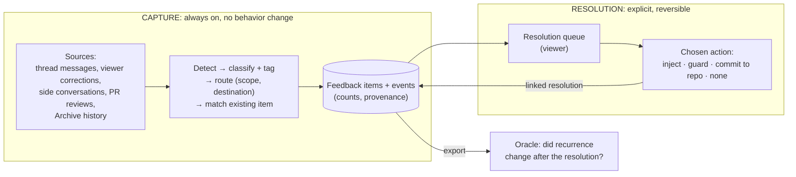

# Feedback loop

**Status: hypotheses, not a settled design.** This document covers journey goal 8 in the [system map](SYSTEM-MAP.md) ("process feedback captured into a middleware layer") and the measuring half of goal 9. Treat what follows as working hypotheses and the experiments that would test them, not as decisions.

Code references point at `origin/main` as of 2026-09-30:

| Repo | Commit |
|---|---|
| Foundry | `bc53278` |
| Oracle | `b961afd` |
| Archive | `ab3f173` |
| agent-session | `320eee1` |

A `path:line` with no prefix is in Foundry. References into other repos carry the repo name as a prefix, for example `oracle:src/cli.ts:218`.

## The point

Models get better, but they don't change how they behave. Aron gives the same process feedback over and over, for example "merge it yourself" or "use the primitive that already exists". The thesis is that we can make that change last without retraining.

Today `~/code/inixiative/FEEDBACK-LOG.md` does this by hand: 24 tagged rules with repeat counts. Rule 1 has recurred about 28 times even though it is written into `CLAUDE.md`.

**The metric is recurrence**: how often the same feedback comes back.

### Capture and resolution are separate

Capturing feedback is cheap and safe. Deciding what to do about it is neither:

- **Resolutions are not obvious.** A captured correction often doesn't say what should change, or where.
- **Automatic action can make things worse.** Examples:
  - a misread rule injected into every session
  - an over-broad guard that blocks good work
  - two rules that contradict each other
  - a "fix" for one project that leaks into another context

So the loop has two halves:

- **Capture** is always on and has no side effects on behavior. It detects feedback, tags it, routes it, dedupes it, counts recurrences and stores provenance. Nothing it does changes what an agent sees.
- **Resolution** is any change to behavior: injecting a rule, guarding against it, escalating it, or committing it to a repo. Every resolution is a separate, explicit, reversible step. **Nothing resolves automatically.** Whether some resolutions should later become automatic is itself a hypothesis to test (section 5).



## 1. Capture (always on)

### 1.1 Detect

**What exists:**

- **Viewer correction form.** The "Correction" form in the trace drawer (`viewer/ui/detail-drawer.js:613-639`) posts to `POST /api/threads/:threadId/interventions` (`viewer/routes/runtime.ts`). That emits a `correction` signal on that thread's bus (`packages/core/src/intervention.ts`). The log is kept in memory only.
- **User messages** enter at `POST /api/messages/send` (`viewer/routes/runtime.ts:514-560`). Nothing inspects them for feedback.
- **`oracle mine`** detects corrections in Claude Code transcripts. It uses an interrupt marker or an opener regex (`oracle:src/session-miner.ts:216-272`) and appends results to `.oracle/corrections.jsonl` (`oracle:src/cli.ts:218-225`). It has three gaps:
  - no dedupe
  - no Codex or Archive input
  - nothing reads the file it writes

**What's missing:**

- Live detection.
- Explicit phrases such as "remember this", "from now on", "always" and "never".
- Repeat markers such as "again", "I thought we…" and "once and for all". These are the strongest sign that something already failed, and the opener regex misses most of Aron's process feedback.

**Smallest change:** a new `FeedbackCapture` piece (`agents/feedback-capture.ts`).

- It reads accepted user turns and operator corrections, after the turn is accepted and off the critical path.
- A deterministic prefilter runs first. The prefilter regex lives in foundry-core as data, so Oracle's backfill uses the same filter.
- Also fix the InterventionLog binding so a correction lands on its own thread's bus.

### 1.2 Classify, tag, route

**What exists:**

- `SignalKind` already names `correction | convention | taste | ci_rule | adr | security` (`packages/core/src/signal.ts:5-12`).
- FEEDBACK-LOG uses 12 tags, and its rows also use `process`, which is missing from that list.
- Decision roles already run on warm subscription sessions (`providers/decision-priority.ts:3`).

**Smallest change:** one decision call per candidate message.

- **Inputs:** the user message, the previous assistant turn (bounded like `domain-librarian.ts:213-218`), and the existing feedback items in scope.
- **Output:** `{ feedback: none|process|convention|taste|fact, explicit, match, statement, tags, scope, destination, confidence }`.
- **What the outputs mean:** the classifier only *suggests* `scope` and `destination`. They are labels for the resolution queue, not actions.
- **Why this can't reuse a Warden:** a Warden's advise output is fixed at `{layers, snippets, confidence}` (`domain-librarian.ts:624-625`), and its learning review writes free text that stays private to the thread (`domain-librarian.ts:234-310`). Neither returns a structured item, so this one prompt and parser are new.

### 1.3 Dedupe and count

**What exists:**

- `CorpusCompiler` dedupes only exact strings (`agents/corpus-compiler.ts:137-145`).
- Oracle's `gaps` and `suggestions` count exact strings (`oracle:src/store.ts:323-411`).
- Nothing counts the same feedback recurring.

**Smallest change:**

- The classifier's `match` field *is* the dedupe. A match appends a `recurred` event to the existing item; no match creates a new item with a `captured` event.
- Counts are derived from events, so every count links to the messages behind it.
- The viewer gets a manual merge action for duplicates.

### 1.4 Store with provenance, without injecting

**What exists:**

- Foundry memory already stores scoped records (`thread | project | global`, `packages/core/src/tools.ts:303-324`).
- Memory also separates **pinned** kinds, which are injected every turn, from **audit-only** kinds, which are retained but never injected (`packages/core/src/adapters/file-memory.ts:46-56`).
- `correction` is a pinned kind. So today every correction signal is already injected into its thread every turn (`start.ts:390`). **That is an automatic resolution, and it should go.** Advisory guard findings are already separate: they are `guard_finding`, an audit-only kind (#53).

**Smallest change:**

- Store feedback items as `feedback_item` and events as `feedback_event`. Both are audit-only kinds: searchable through `foundry_memory`, never injected.
- Capture then changes no behavior by construction.

## 2. Routing: scope and destination

A captured item carries two routing labels. Capture only suggests them; the resolution queue is where they get decided.

**Scope** is a hierarchy. Each level has its own set of feedback, and a narrower level can override a wider one:

```
global
  └─ context (personal · inixiative · UserEvidence)
       └─ project (a repo within that context)
```

- Foundry memory already has `project` and `global` visibility, and publishing from one to the other is explicit through `FileMemory.publish` (`file-memory.ts:456-469`). Nothing calls `publish` today.
- **The context level is missing.** The likely key is the Kingdom owner that a project's integrations already bind to (`viewer/config.ts:407-436`).
- Without a context level, a rule like "merge it yourself" either leaks into UserEvidence projects or has to be copied into every inixiative project.

**Destination** is where a resolution would live:

| Destination | Reaches | Review path |
|---|---|---|
| Foundry memory (pinned `rule` record) | Foundry sessions in that scope | Viewer; undo is a click |
| Committed to the repo (`CLAUDE.md`/`AGENTS.md`, docs, lint/CI rule) | Every session and every teammate, including sessions outside Foundry | A PR; undo is a revert |
| Tracked only | Nobody | Nothing changes; the item keeps counting |

Some feedback belongs in the repo, for example a project convention that CI could enforce. Some is personal or about process and belongs in memory. Which destination fits which kind of feedback is an open question (section 6).

## 3. Resolution (separate, explicit, reversible)

Resolution starts from a queue in the viewer. The queue shows items ranked by recurrence, along with their routing labels and the messages behind them. A person, or later possibly an agent with a person approving, chooses an action. Each action is recorded as a `resolution` linked to the item and can be undone.

**What exists for each possible action:**

- **Inject.**
  - A pinned memory record of kind `rule` would be injected on every turn in its scope (`file-memory.ts:181-200`).
  - Each turn's `SourceSelectionReport` records which records were injected (`packages/core/src/context-layer.ts:45-62`). That gives an exposure count for measurement.
- **Guard.**
  - A configured Warden that owns a `rules` layer guards tool calls against that layer (`agents/configured-experts.ts:23-60`, `domain-librarian.ts:873-930`).
  - Guards don't see the assistant's reply (`domain-librarian.ts:647-651`), although the post-turn review slot does (`domain-librarian.ts:161-184`).
- **Commit to the repo.** A PR against the project's own `CLAUDE.md`, docs or CI. Foundry records the link and never edits a shared checkout.
- **Supersede, revoke, retire.** A reversal supersedes the old rule. A wrong rule is revoked. A rule whose need disappeared, because the code is gone or a check enforces it now, is retired. All of these are explicit. `DocState` in `CorpusCompiler` (`corpus-compiler.ts:45-50`) describes the same lifecycle, but nothing calls it.

**Not wired:**

- `RuleCompiler.recompileOn` (`domain-librarian.ts:465-494`) is never read.
- `CorpusCompiler.ingestFromSignalBus` (`corpus-compiler.ts:148-163`) would ingest every signal and would be a parallel store.
- Both are candidates for deletion. Wiring either one would build automatic resolution.

## 4. Measurement: what Oracle would measure

Measurement turns the hypotheses below into evidence. It reads Foundry's exported items, events and resolutions (`foundry feedback export`), using the same on-disk interchange as `SubjectArtifact` (`oracle:src/artifacts.ts:26-47`).

- **Recurrence rate, with no model calls.** For each item, count recurrences per 100 turns in scope, before and after a resolution. For an injected rule, "after" counts only turns where the rule was actually injected.
  - Guard catches are counted separately.
  - Oracle's `trends` (`oracle:src/store.ts:271-315`) can fit the slope.
- **Feedback probes, a new fixture kind that can't be avoided.**
  - Each event carries the assistant turn that drew the feedback and the turns before it.
  - A probe replays that prefix with and without a candidate resolution. An LLM judge scores the reply against the item's statement.
  - Two existing Oracle pieces carry over unchanged: the training/held-out split, with `family = itemId` (`oracle:src/experiments/schedule.ts:44-62,98-113`), and the shared-fixture-only `compare`, whose `incomparable` verdict also carries over (`oracle:src/store.ts:186-263`).
  - Probes are blocked until Oracle runs on subscription capacity (system map goal 9; today `oracle:src/providers.ts:167-190` requires API keys).
- **Attribution by model and effort.** "This keeps recurring" means different things on different models and reasoning-effort levels. Archive snapshots don't record either one today (`archive:src/index.ts:6-35`, a strict schema). Archive should carry **model and effort level per session and per turn**, so Oracle can split recurrence by model and effort. The Archive owner (inixiative-88) is being asked to add this. Foundry's capture would then fill those fields (`archives/capture.ts:6-49`).

## 5. Hypotheses to test

| # | Hypothesis | Experiment that decides it |
|---|---|---|
| H1 | Injecting a rule as text lowers its recurrence | Before/after recurrence rate on injected turns; probes with the rule on vs off, on held-out events |
| H2 | Text alone stops working for some kinds of feedback (FEEDBACK-LOG rule 1 suggests so); a guard or a repo check does better | For items that still recur while injected, compare guard and structural resolutions against injection |
| H3 | Some resolutions are safe to apply automatically (for example explicit "remember this", project scope, memory destination) | Run manual resolution first. Measure how often a person reverts or edits a proposed resolution, and automate only the classes with a near-zero revert rate |
| H4 | Committing to the repo lasts longer than Foundry memory | Compare recurrence for items resolved into `CLAUDE.md`/CI with items resolved into memory, including sessions run outside Foundry |
| H5 | Recurrence depends on model and effort | Split recurrence by the model and effort recorded in Archive |
| H6 | Automatic escalation (for example, two recurrences turn an injected rule into a guarded one) helps more than it hurts | Only after H2. Escalate a test set by hand and measure false-positive guard findings against recurrence prevented |

## 6. Data model

Capture and resolution use separate records. All of them are audit-only memory records, so none of them is ever injected.

```ts
interface FeedbackItem {            // kind: "feedback_item"
  id: string;                       // newId("fb")
  statement: string;                // what the feedback says, one line
  tags: FeedbackTag[];              // FEEDBACK-LOG's 12 + process; closed enum in foundry-core
  class: "process" | "convention" | "taste" | "fact";
  scope: { level: "global" | "context" | "project"; contextId?: string; projectId?: string };
  destination?: "memory" | "repo" | "none";   // suggested until resolved
  origin: "explicit" | "inferred" | "intervention" | "side-conversation" | "review" | "seed" | "mined";
  seedCount?: number;               // FEEDBACK-LOG count with no event evidence
  status: "open" | "resolved" | "superseded" | "dismissed";
}

interface FeedbackEvent {           // kind: "feedback_event"
  id: string; itemId: string | null;
  type: "captured" | "recurred" | "caught" | "merged" | "edited";
  at: number;
  ref: { threadId?: string; turnId?: string; messageId?: string; projectId?: string;
         archive?: { archiveId: string; revision: number; entryId: string }; github?: string };
  model?: string; effort?: string;  // from the session, when Archive carries it
  quote?: string; before?: string;  // bounded and scrubbed; material for probes
  injected?: string[];              // resolution ids active in this turn
  classifier?: { providerId: string; confidence: number; requestHash: string };
}

interface FeedbackResolution {      // kind: "feedback_resolution"
  id: string; itemId: string;
  action: "inject" | "guard" | "repo" | "none";
  target: string;                   // rule record id, Warden id, or PR URL
  scope: FeedbackItem["scope"];
  decidedBy: string; at: number;
  status: "active" | "reverted" | "superseded" | "retired";
}
```

**Where each record lives:**

- **Items, events and resolutions:** Foundry memory (`.foundry/memory`, `start.ts:312`), since Foundry owns context and middleware.
- **Session evidence:** stays in Archive. Foundry adds `feedback:<id>` to `thread.meta.tags`, which capture already copies (`archives/capture.ts:46`).
- **Oracle:** reads the export.
- **Kingdom:** stores nothing.
- **Sharing across Foundries:** an open question. One option is the context's Archive. The Archive branch `feat/actors-references` adds tag definitions and references, and `archive:tickets/ARC-008-retrospective-proof.md` already asks for "find and cite actual corrections".

## 7. Seeding

1. **Import FEEDBACK-LOG.** `foundry feedback import FEEDBACK-LOG.md` creates one item per row, with `origin: "seed"`, `seedCount` and its tags. Rows already marked Done are imported with a `repo` or `none` resolution that points at where they were done. **Import creates no injections.**
2. **Backfill.** Run the matcher over Sept 11–30 Archive history (Claude Code and Codex) to turn the hand counts into cited `recurred` events. This also gives the "before" rate.
3. **Reconcile with CLAUDE.md.** Rules in `~/code/inixiative/CLAUDE.md` that match an item are recorded as existing `repo` resolutions. That is what they are, and it lets H4 be measured from day one.

## 8. Side conversations (idea)

Sometimes Aron wants to give feedback about a thread, or discuss how something should work, without putting that into the thread's own context. A side conversation would be a fork-like thread that **refers to** the current thread without being part of it. Anything said there is captured with `origin: "side-conversation"` and a reference to the parent thread and turn.

What Foundry already has:

- **Parent links.** `ThreadMeta.parentThreadId` (`packages/core/src/thread.ts:30-31`, set at `:175`) links a child thread to its parent.
- **A fork route.** `POST /api/threads/:id/fork` (`viewer/routes/runtime.ts:851-930`) creates a child thread in the same project, with its own stack and memory scope, and copies messages. It returns 501 when the local session store is active (`runtime.ts:865`), and that is the normal path.
- **A side chat.** The Foundry "self-chat" (`viewer/foundry-self-chat.ts:12-18`, `viewer/routes/control.ts:511-545`) is a single long-lived side chat about the Foundry install. It has a `focus` of project, layer, agent or source, but not a thread or turn.

**Smallest version:** add a `thread`/`turn` focus to the side chat, or a "discuss" fork that holds a reference instead of copying messages. Either way, messages there go through capture like any other. Which shape is right is open.

## 9. Open questions

Each answer below is the leaning to test, not a decision.

1. **Which resolutions, if any, should ever be automatic?** Leaning: none until H3 has data.
2. **Which destination fits which kind of feedback?** Leaning: conventions CI can check go to the repo; personal and process feedback goes to memory. Test it with H4.
3. **How should contexts be keyed, and can a project override its context?** Leaning: by the Kingdom owner, with the narrower scope winning.
4. **What counts as "the same" feedback?** Leaning: the same intent at classifier confidence ≥ 0.7. Below that, create a linked candidate duplicate. Over-merging hides failures.
5. **How do feedback sets sync across several Foundries?** Leaning: keep them local until a second Foundry exists, then sync through the context's Archive.
6. **What shape should a side conversation take?** A thread-focused side chat, or a fork that holds only a reference.
7. **Should `RuleCompiler` and `CorpusCompiler` be deleted?** Leaning: yes. Neither has a caller, and both point toward automatic resolution.

## 10. Phases

**Phase 1: capture and visibility. Resolution stays manual.**

- `FeedbackCapture` runs the prefilter and the classifier call, and stores items and events as audit-only records with provenance and routing labels.
- Viewer:
  - a chip on the message: "feedback captured" or "↻ recurred ×3"
  - a project **Feedback** panel showing each item's count, the messages behind it, and its tags, scope and destination labels
  - edit, merge and dismiss actions
- Fixes:
  - InterventionLog uses the right thread's bus.
  - Corrections and guard findings stop being pinned.
- `foundry feedback import` seeds the FEEDBACK-LOG rows.
- Any resolution is done by hand (a pinned record, or a PR) and recorded as a `resolution`, so the before/after counts start accumulating.

**Phase 2:**

- context scope
- Archive backfill
- `feedback:` tags in Archive
- `foundry feedback export`
- side conversations

**Phase 3:**

- a resolution queue with one-click inject/guard/PR actions
- a `rules` Warden that cites rule ids
- recurrence reports in Oracle

Every resolution is still explicit.

**Phase 4:**

- Oracle probes, held-out splits and attribution by model and effort
- automating only the resolution classes the evidence supports (H3, H6)

## Findings to fix regardless

- ~~**Guard findings are pinned.**~~ Fixed in #53: advisory findings are `guard_finding`, an audit-only kind.
- ~~**Viewer corrections go to the wrong thread.**~~ Fixed in #53: corrections post to `/api/threads/:threadId/interventions` and land on that thread's bus.
- **`oracle mine` writes duplicates nobody reads.** It appends the same corrections on every run, and nothing reads `corrections.jsonl` (`oracle:src/cli.ts:218-225`).
- **Session-mined fixtures overwrite each other.** Fixtures from different sessions get the same name, `session__<repo>__<n>.json` (`oracle:src/session-miner.ts:351-358`, `oracle:src/fixture-store.ts:97-100`).
- **Imported sessions have no `turnId`.** Archive's Claude and Codex importers never set it, so references into mined history have to use `(archiveId, revision, entryId)`.
