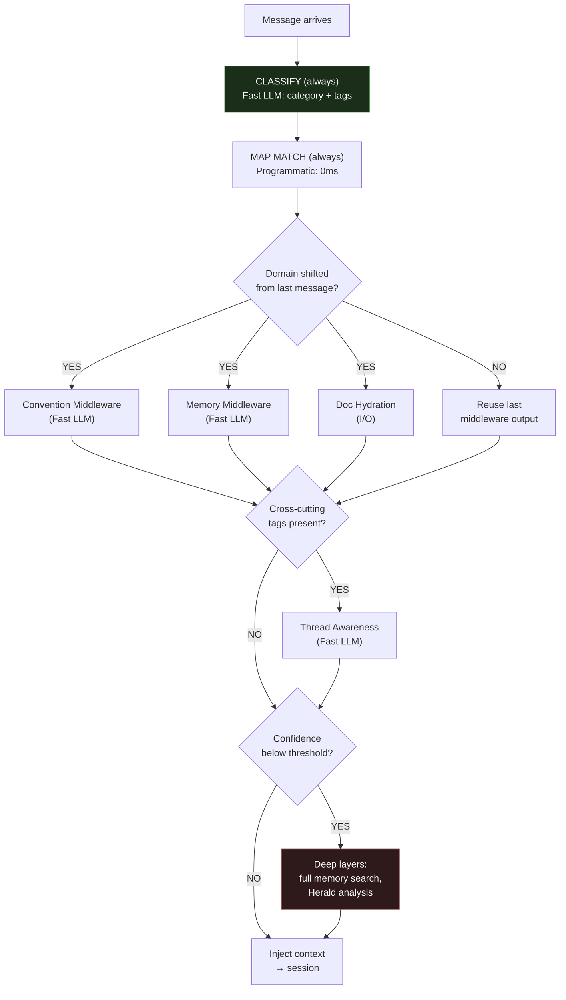
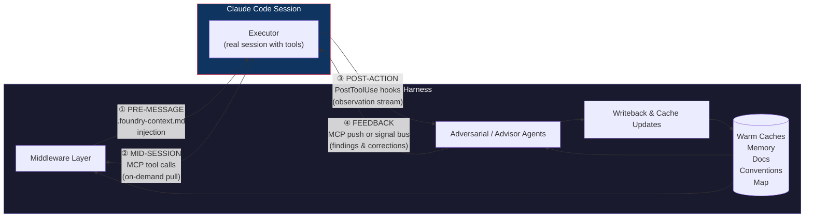
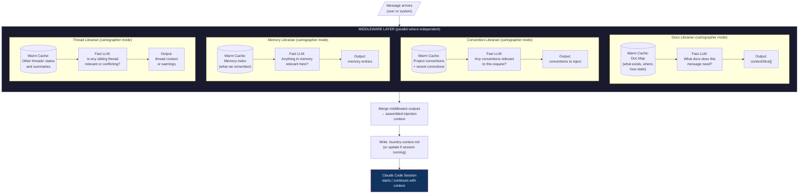
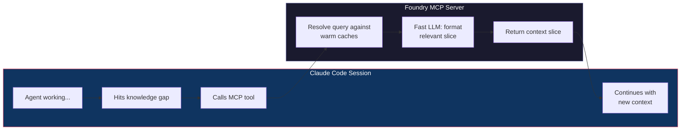
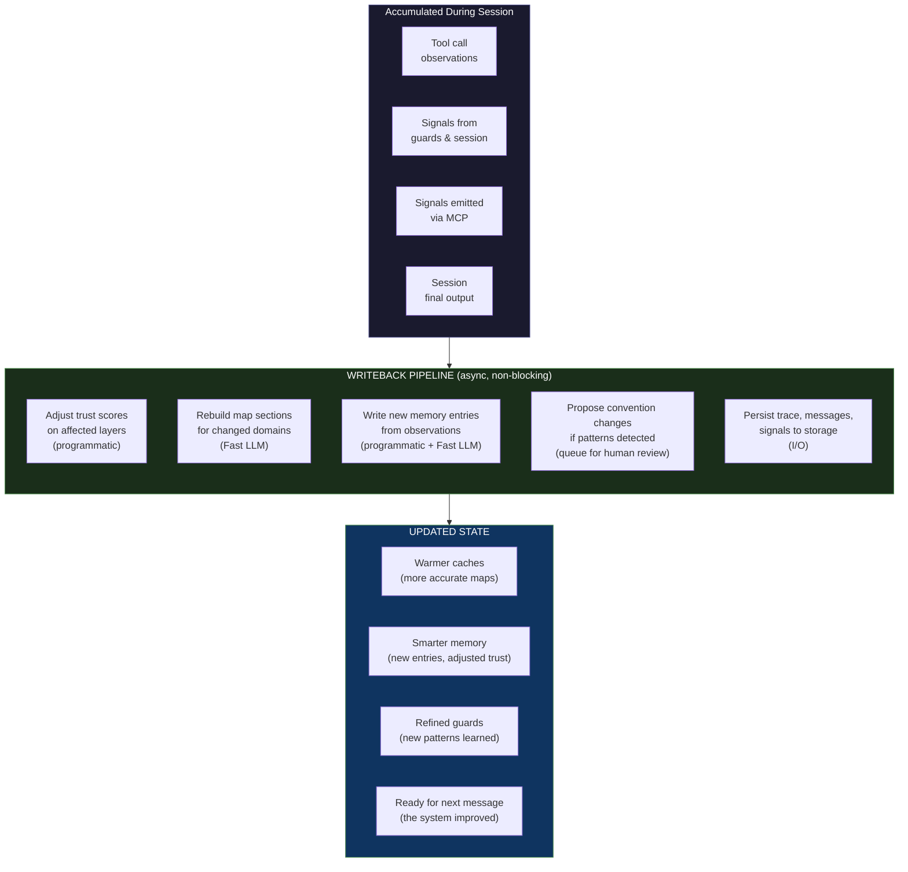
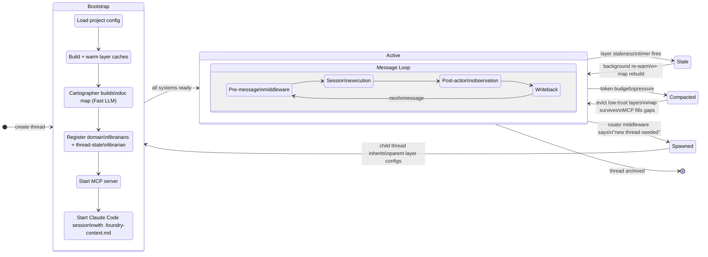

# Foundry Harness — Data Flow & Request Lifecycle

> Northstar document. This is how data and requests move through the Foundry harness.
> Every design decision traces back to two constraints: **token budget** and **latency**.
> Every architectural choice answers one question: **how does the system get smarter after each interaction?**

---

## The Core Model

Foundry is a nervous system wrapped around a Claude Code session.

Claude Code does what it's already good at — tool use, file access, codebase reasoning. Foundry adds what it doesn't have: persistent memory, project conventions, multi-thread awareness, adversarial validation, and an observation loop that makes everything smarter over time.

```
┌──────────────────────────────────────────────────────────────────────┐
│  FOUNDRY HARNESS                                                     │
│                                                                      │
│  ┌─ DOMAIN LIBRARIANS ──────────────────────────────────────────┐   │
│  │  Each domain has a librarian that maintains its warm cache     │   │
│  │  (map + content) and can both advise pre-message and           │   │
│  │  guard post-action.                                            │   │
│  │                                                                │   │
│  │  Docs Librarian      → doc map, full doc content, hydration   │   │
│  │  Convention Librarian → naming, patterns, structure rules     │   │
│  │  Security Librarian   → injections, vulns, auth patterns      │   │
│  │  Architecture Librarian → module boundaries, dependencies     │   │
│  │  Memory Librarian     → past decisions, failures, patterns    │   │
│  │  Thread Librarian     → sibling thread status, conflicts      │   │
│  └──────┬─────────────────────────────────────▲──────────────────┘  │
│         │ inject context + findings            │ observe + signals   │
│         ▼                                      │                     │
│  ┌─────────────────────────────────────────────┤                    │
│  │  CLAUDE CODE SESSION (persistent)           │                    │
│  │  Full tool access, real codebase work       │                    │
│  │                                             │                    │
│  │  MCP bridge → librarians for context ───────┤                    │
│  │  Every tool call → PostToolUse hook ────────┘                    │
│  └─────────────────────────────────────────────┘                    │
│         │ observations                                               │
│         ▼                                                            │
│  ┌─ THREAD-STATE LIBRARIAN (sole writer) ────────────────────────┐  │
│  │  Consumes all signals from domain librarians.                  │  │
│  │  Reconciles into the unified thread-state layer.               │  │
│  │  Classifies signals by type (correction, convention,           │  │
│  │  taste, ADR). All middleware predicates read this state.        │  │
│  └───────────────────────────────────────────────────────────────┘  │
└──────────────────────────────────────────────────────────────────────┘
```

### Two Roles, Not Five Agent Types

Every domain agent is the same pattern: **a librarian that maintains a warm cache (map + content) and can both advise (pre-message) and guard (post-action)**. The difference is the domain, not the role.

| Domain Librarian | Warm Cache | Pre-message (advise) | Post-action (guard) |
|-----------------|------------|---------------------|-------------------|
| **Docs** | Doc map + full content | "Which docs does this message need?" | "Did this edit invalidate any docs?" |
| **Convention** | Naming/pattern rules | "Which conventions apply here?" | "Does this edit violate conventions?" |
| **Security** | Security patterns, OWASP | "Any security context to inject?" | "Does this change introduce a vuln?" |
| **Architecture** | Module boundaries, deps | "Cross-module work?" | "Does this respect boundaries?" |
| **Memory** | Past decisions, failures | "Have we seen this before?" | "This pattern failed last time" |
| **Thread** | Sibling thread summaries | "Is another thread relevant?" | "Thread B is editing the same file" |

Each librarian has two modes:
- **Cartographer mode** (pre-message): reads its map, advises what context to inject
- **Guard mode** (post-action): reads its cache, evaluates tool call observations

The **Thread-State Librarian** is special — it doesn't own a domain. It's the sole writer to the thread-state layer. It consumes signals from all domain librarians and reconciles them into one coherent state that all middleware predicates read.

When debugging:
- Wrong conventions injected? → **Convention Librarian** (bad cache or wrong match)
- Security issue slipped through? → **Security Librarian** (missed it or wasn't triggered)
- Incoherent thread state? → **Thread-State Librarian** (bad reconciliation)
- Duplicate work across threads? → **Thread Librarian** (didn't detect convergence)

---

## Design Principles

1. **Don't reinvent Claude Code.** It already has tool use, file discovery, and codebase reasoning. Wrap it, don't replace it.
2. **Middleware = LLM-backed decision slices.** Each middleware consumes a warm cache + the message and produces a decision. That's an LLM call, not a boolean check. The warm cache is the *input* to the call, not a substitute for it.
3. **Cheap models for decisions, capable models for work.** Middleware and adversarial agents use Haiku/Flash. The executor session uses whatever Claude Code is running.
4. **Pull over push.** Don't frontload every possible context. Inject what the middleware predicts is needed, let the session pull the rest via MCP.
5. **Progressive depth, not blanket evaluation.** Basic layers run every message. Deeper layers run only when something changes — domain shift, confidence drop, new trigger. Most steady-state messages hit only classification + map match. The system escalates to deeper middleware and guards based on what the basic layers detect.
6. **Backpropagation is the whole point.** Every execution updates caches, trust scores, and maps. The system improves after every interaction, not just when someone edits a config.
7. **Grep is always available.** When a summary says "this might be relevant" but isn't sure, programmatic search resolves it without an LLM call.

---

## Model Routing

| Role | Model Tier | Examples | Why |
|------|-----------|----------|-----|
| Middleware decisions | Fast/Cheap | Haiku, Gemini Flash | Small context, structured output |
| Adversarial guards | Fast/Cheap | Haiku, Gemini Flash | Narrow slice, yes/no + reasoning |
| Advisor agents | Fast/Cheap | Haiku, Gemini Flash | Observation + cache, short output |
| Map building/rebuild | Fast/Cheap | Haiku, Gemini Flash | Summarization task |
| Executor session | Capable | Whatever Claude Code runs | The real work |
| MCP query resolution | Fast/Cheap | Haiku, Gemini Flash | Cache lookup + formatting |

---

## Progressive Depth — Tiered Frequency Model

Not every layer runs on every message. Not every guard runs on every tool call. The system escalates from cheap/fast basics to expensive/deep analysis only when something triggers it.



### Middleware tiers

| Tier | What runs | Trigger | Steady-state frequency |
|------|-----------|---------|----------------------|
| **Always** | Classification + map match | Every message | Every message |
| **On domain shift** | Convention, memory, doc hydration middleware | Classification output differs from last N messages | ~20% of messages in a focused session |
| **On cross-cutting signals** | Thread awareness middleware | Classification tags indicate multi-domain or shared-resource work | ~5% of messages |
| **On low confidence** | Deep memory search, Herald analysis, full map rebuild | Basic layers return low-confidence or empty results | ~2% of messages |

### Guard tiers

| Guard | Trigger | Skips |
|-------|---------|-------|
| Convention Guard | File-write tool calls | Reads, bash commands, grep |
| Security Guard | Code-write tool calls | Reads, non-code file edits |
| Architecture Advisor | File creation or cross-module imports | Edits within same module |
| Memory Advisor | Always (programmatic pattern match, ~0ms) | Never — it's free |

### The thread-state layer makes this work

The tiered model requires every middleware predicate to answer "should I run?" That question requires knowing what the thread already knows — current domain, what's in context, recent activity. If each middleware independently reconstructs this from dispatch logs, you've defeated the purpose of tiering.

The solution: one of the warm caches IS the thread summary. A thread-state layer (~200-500 tokens, always warm) that the writeback loop keeps current:

```
Thread State Layer:
{
  "domain": "auth",
  "recentActivity": ["edited auth/middleware.ts", "read auth/service.ts"],
  "inContext": ["auth-conventions", "security-patterns"],
  "lastClassification": { "category": "feature", "tags": ["security", "api"] },
  "messageCount": 12,
  "compactionState": "none"
}
```

Every predicate becomes a cache read:
- **"Domain shifted?"** → `threadState.domain !== currentClassification.category`
- **"Need thread awareness?"** → check `recentActivity` for cross-module patterns
- **"Convention guard relevant?"** → tool call touches files outside `threadState.domain`

No LLM calls, no dispatch log scanning. The awareness layer IS the state. This is why awareness layers must be first-class primitives — they're not a dashboard feature, they're the mechanism that makes the entire tiered system efficient.

### One writer, many readers

Multiple middleware, guards, and advisors run in parallel — all producing signals. But only **one entity writes the thread-state layer**: the thread-state manager.

```
Parallel agents (readers + signal emitters):
  Classification ──→ { category: "feature", tags: ["security"] }
  Convention MW ───→ "auth conventions applied"
  Security Guard ──→ "clean"
  Architecture ────→ "cross-module edit detected"
  Tool observation → "edited auth/middleware.ts"
           │
           ▼
Thread State Manager (sole writer):
  Consumes all signals → reconciles into one coherent state
  Writes → thread-state layer
```

Why sole writer matters:
- **Coherence** — the layer is always a consistent snapshot, never a race between parallel writers
- **Reconciliation** — when classification says "auth" but architecture advisor says "cross-module," the manager reconciles: `{ domain: "auth", flags: ["cross-module"] }`. That's a judgment call, not last-write-wins.
- **Predicates stay simple** — every middleware reads one coherent state

The thread-state manager is mostly a programmatic reducer: last classification wins for domain, append-only for activity, union for flags. It only needs a Fast LLM call when signals genuinely conflict and need reconciliation — which is rare in a focused session.

### Why this works

Most consecutive messages in the same thread are about the same topic. If messages 5 through 12 are all about auth middleware, the convention/memory/doc middleware output from message 5 is still valid at message 12. Re-running it is waste.

The classification tier is always cheap (~200ms, one Fast LLM call). It's the gatekeeper — but it doesn't decide alone. It compares its output against the thread-state layer (0ms read) to determine whether downstream middleware needs to fire.

**Cost impact:** A 50-message session where 80% of messages reuse cached middleware output runs ~10 middleware stacks instead of 50. At Flash rates, that's $0.04 instead of $0.20. Already cheap, now cheaper.

---

## The Four Communication Channels

Every interaction between Foundry and the executor session flows through one of four channels:



| Channel | Direction | Mechanism | When | Latency |
|---------|-----------|-----------|------|---------|
| ① Pre-message | Foundry → Session | `.foundry-context.md` injection | Before session starts or on new message | ~400ms (middleware LLM calls) |
| ② Mid-session | Session → Foundry | MCP tools | Agent discovers it needs context | ~200ms per query |
| ③ Post-action | Session → Foundry | PostToolUse hooks | After every tool call | ~0ms (async capture) |
| ④ Feedback | Foundry → Session | MCP push or queued for next message | When adversarial/advisor agents flag something | ~200-500ms (guard LLM call) |

---

## Loop 1: Pre-Message (Middleware → Inject)

When a message arrives — or when the harness decides the session needs updated context — middleware runs to contextualize before the executor sees it.



### Middleware execution model

Each middleware:
1. **Has a warm cache** — semi-static state that was pre-loaded (docs index, conventions, memory entries, thread summaries). These are the context layers from the existing system.
2. **Gets the message** — the user's request or system event.
3. **Makes an LLM call** — cheap/fast model compares the message against its warm cache to produce a decision. This IS the classification/routing work, distributed across middleware.
4. **Produces output** — a structured decision (which docs to load, which conventions apply, which memory is relevant, whether sibling threads matter).

Middleware can run in parallel when independent. Doc awareness and convention middleware don't depend on each other. Thread awareness might depend on classification output if you want to narrow the search.

### What "warm cache" means concretely

A warm cache is **not** the full content of every doc or every memory entry. It's a **summarized, structured index** built by a fast LLM at bootstrap and refreshed on change:

```
Doc Map Cache (~500 tokens):
{
  "auth": { "layers": ["auth-conventions", "auth-api-docs"], "size": "9.2k tokens", "lastUpdated": "2h ago" },
  "testing": { "layers": ["test-patterns", "fixture-guide"], "size": "4.1k tokens", "lastUpdated": "1d ago" },
  "security": { "layers": ["security-patterns", "owasp-checklist"], "size": "6.3k tokens", "lastUpdated": "3h ago" }
}
```

The middleware LLM sees this compact index + the message and says "pull auth-conventions and security-patterns." It doesn't see 20k tokens of full docs — it sees 500 tokens of map and makes a routing decision.

When the router says "pull auth-api-docs," that layer gets hydrated (file I/O, not LLM) and injected into the context file.

---

## Loop 2: Mid-Session Bridge (MCP)

The Claude Code session has a minimal MCP server that connects it back to Foundry. When the agent discovers it needs context that wasn't frontloaded, it pulls.



### MCP Tool Surface (minimal)

```
foundry.query(topic: string, detail?: "summary" | "full")
  → "What do you know about [topic]?"
  → Hits map, returns matching layer content
  → detail="summary" returns the map entry (~50 tokens)
  → detail="full" hydrates and returns the actual layer (~1-8k tokens)

foundry.conventions(domain: string)
  → "What are the conventions for [domain]?"
  → Returns matching conventions from warm cache

foundry.memory(query: string)
  → "Have we seen [pattern] before?"
  → Searches memory systems, returns relevant entries

foundry.threads()
  → "What are other threads working on?"
  → Returns session manager summary of active threads

foundry.signal(kind: string, content: string)
  → "I found something important"
  → Emits directly into signal bus — immediate, not deferred
  → Kinds: "missing_context", "wrong_convention", "security_concern",
           "architecture_observation", "correction"
```

### Why MCP solves mid-session injection

The old problem: Foundry can't pause a running Claude Code session to inject context.

The MCP solution: Foundry doesn't need to. The session asks for what it needs, when it needs it. The agent is already good at recognizing knowledge gaps ("I need to check the auth conventions") — MCP gives it a way to resolve those gaps without grepping through files and hoping.

The MCP tools show up in the Claude Code session as available tools alongside file read/write, bash, etc. The agent uses them naturally as part of its reasoning.

---

## Loop 3: Post-Action Observation (Hooks → Guards → Backpropagation)

Tool calls from the Claude Code session fire PostToolUse hooks. Foundry captures these observations and runs guards — but not all guards on every call. Guards are trigger-gated, same as middleware.


### Same librarians, two modes

There's no separate "guard" agent type. The same domain librarians that advise pre-message also guard post-action. The difference is just mode:

| | Cartographer mode (pre-message) | Guard mode (post-action) |
|---|---|---|
| **Runs when** | Before session starts (tiered by domain shift) | After matching tool calls (trigger-gated) |
| **Input** | User message + warm cache | Tool call observation + warm cache |
| **Output** | Context to inject | Finding (or all-clear) |
| **Urgency** | Blocking (session waits) | Non-blocking (async, except critical) |
| **Gating** | Classification domain shift | Tool call type (file-write, code-write, etc.) |

Guard mode is trigger-gated: a file-read doesn't fire the Convention Librarian's guard mode, a bash command doesn't fire the Security Librarian. This means a session that does 50 tool calls but only 15 are file-writes runs convention guard 15 times, not 50. The Memory Librarian is the exception — it's programmatic pattern matching, so it runs on everything for free.

When a librarian in guard mode finds something:

- **Critical findings** (security, breaking changes) → push immediately via MCP into the session. The agent sees it as a tool result: "Security Librarian: SQL injection risk in the query you just wrote on line 42 of auth/service.ts"
- **Advisory findings** (style, suggestions) → emit as signals to the Thread-State Librarian. The session doesn't see them immediately, but they feed into writeback and will inform future cartographer decisions.

### The Memory Librarian is special

Unlike the other domain librarians, the Memory Librarian doesn't necessarily need an LLM call in guard mode. It does **programmatic pattern matching** against known failure modes:

- "The last time someone edited this file and used that pattern, it was reverted in PR #847"
- "This function signature was changed 3 times in the last month — it's unstable"
- "A similar approach was tried in thread-feature-auth and abandoned"

This is grep + structured memory, not LLM reasoning. Fast and free.

---

## Loop 4: Writeback (The System Gets Smarter)

After the session completes (or periodically during long sessions), Foundry processes all accumulated signals and observations to improve its state.



### What writeback concretely updates

| What | How | Trigger |
|------|-----|---------|
| **Layer trust scores** | Layer that provided useful context → trust++ ; layer whose content was contradicted → trust-- | Every execution |
| **Doc map** | If a layer's content changed (agent edited a file that's a layer source), rebuild that map section | File-change observation |
| **Memory entries** | New observations become memory entries: "auth module uses middleware pattern X" | Guards + session signals |
| **Convention proposals** | If the same correction appears 3+ times, propose it as a formal convention | Signal frequency threshold |
| **Guard caches** | New security patterns, new architecture boundaries discovered during session | Guard findings + session observations |
| **Thread summaries** | Update this thread's summary so other threads' middleware can see what happened | Session completion |

### Why writeback matters

Without writeback, every session starts from the same baseline. With writeback:
- The doc map gets more accurate (middleware makes better frontloading decisions)
- Memory accumulates (the MCP returns richer results)
- Guards learn new patterns (fewer false negatives over time)
- Trust scores reflect reality (compaction evicts the right things)

This is the gradient descent on corpus from the vision doc — every execution is a training step.

---

## Thread Lifecycle

How a Foundry thread (wrapping a Claude Code session) moves through its lifecycle.



### Cold start vs steady state

**Cold start (~2-5s):**
- Build all layer caches (parallel I/O)
- Build doc map (one Fast LLM call)
- Start MCP server
- Start Claude Code session with injected context
- First message has full middleware overhead

**Steady state (~400ms overhead per message):**
- Caches are warm, map is built
- Middleware runs against warm caches (parallel Fast LLM calls)
- Session is already running
- MCP server is ready for pulls
- Guards are watching the tool stream

**After compaction:**
- Low-trust layers evicted, but map survives
- If the session needs evicted content, MCP can pull it on demand
- Writeback from that MCP pull may trigger trust re-evaluation (maybe that layer shouldn't have been evicted)

---

## Complete Decision Reference

Every branching point in the system, who decides, and how.

| Decision | Who | Mode | Model | Input | Speed |
|----------|-----|------|-------|-------|-------|
| What docs does this message need? | **Docs Librarian** | cartographer | Fast LLM | Message + doc map cache | ~200ms |
| Which conventions apply? | **Convention Librarian** | cartographer | Fast LLM | Message + convention cache | ~200ms |
| Any relevant memory? | **Memory Librarian** | cartographer | Fast/Programmatic | Message + memory index cache | ~0-200ms |
| Are sibling threads relevant? | **Thread Librarian** | cartographer | Fast LLM | Message + thread summary cache | ~200ms |
| Reconcile signals into thread state? | **Thread-State Librarian** | — | Programmatic (rarely Fast LLM) | All signals from domain librarians | ~0ms |
| Does this tool call violate conventions? | **Convention Librarian** | guard | Fast LLM | Observation + convention cache | ~200ms |
| Is there a security concern? | **Security Librarian** | guard | Fast LLM | Observation + security cache | ~200ms |
| Does this respect architecture? | **Architecture Librarian** | guard | Fast LLM | Observation + architecture cache | ~200ms |
| Have we seen this pattern fail? | **Memory Librarian** | guard | Programmatic | Observation + failure mode index | ~0ms |
| Which librarians should fire in guard mode? | Trigger gate | — | Programmatic | Tool call type | 0ms |
| Push finding to session or defer? | Trigger gate | — | Programmatic | Finding severity | 0ms |
| Is this layer stale? | Staleness timer | — | Programmatic | `lastWarmed + staleness` | 0ms |
| What to evict under budget pressure? | Trust scores | — | Programmatic | Sorted trust, compaction strategy | 0ms |
| Should a convention be promoted? | **Thread-State Librarian** → batched human review | — | Human | Signal frequency + confidence | Async |
| What context does the session need now? | **Docs Librarian** (via MCP) | cartographer | Fast LLM | Query + warm caches | ~200ms |

---

## Failure Modes

| Failure | Impact | Recovery |
|---------|--------|----------|
| Middleware LLM call fails | Missing context injection for that domain | Session proceeds with partial context; MCP available for on-demand pulls; retry middleware in background |
| Guard LLM call fails | Missed finding for one observation | Other guards still running; that guard retries on next observation; signal emitted so writeback knows |
| MCP server unavailable | Session can't pull on-demand context | Session falls back to native Claude Code tools (grep, file read); degraded but functional |
| Layer fails to warm | Middleware for that domain has empty cache | Middleware knows its cache is cold and says so; session relies on MCP + native tools for that domain |
| Classification is wrong | Wrong layers frontloaded | Session's own reasoning + MCP correct for it; writeback captures the miss for next time |
| Token budget exceeded | Can't fit all matched layers | Evict by trust score; map always survives; MCP fills gaps on demand |
| Claude Code session crashes | Execution interrupted | Foundry has full observation log; can restart session with context rebuilt from observations |
| Fast LLM unavailable | Middleware and guards stall | Fall back to programmatic heuristics (keyword match against map, default routing); degrade gracefully |
| Memory backend down | No persistent memory | Thread-local observations still available; file-based caches still warm; memory writes queue for retry |

---

## What Exists vs What Needs Building

### Already exists in the codebase
- Context layers with warm/stale lifecycle and trust scores
- Context stack with budget-aware assembly
- **ContextStackView** — read-only stack introspection for middleware (`ctx.stack.hasLayer()`, `ctx.stack.getContent()`) — this is what makes the tiered predicate model work without dispatch log scanning
- Middleware chain with tiered execution (always/conditional via `useWhen()`)
- **Retry middleware** — composable exponential backoff with jitter, configurable retryability (excludes permission denials and budget errors)
- **Permission middleware** — integrates CapabilityGate into dispatch pipeline, provider-agnostic allow/deny/ask
- **Message idempotency** — BoundedSet-based dedup at harness ingress, opt-in with configurable capacity
- Signal bus with typed pub/sub
- Session manager with thread spawning and blueprints
- Trace system with full span tree
- ClaudeCodeRuntime with `.foundry-context.md` injection and PostToolUse hook scripts
- ClaudeCodeProvider (currently `-p` mode, needs evolution)
- Compaction strategies (trust-based, LRU, summarize, hybrid)
- Herald cross-thread pattern detection
- Capability gate with policy system (UNATTENDED, SUPERVISED, RESTRICTED) and ActionQueue for human-in-the-loop prompts

### Needs to be built
- **MCP server** — minimal tool surface (query, conventions, memory, threads, signal) exposed to the Claude Code session. This is the mid-session bridge. Each MCP tool routes to the relevant domain librarian: Docs Librarian handles `foundry.query`; Convention Librarian handles `foundry.conventions`; Memory Librarian handles `foundry.memory`; Thread Librarian handles `foundry.threads`.
- **Real session management** — evolve ClaudeCodeProvider from `-p` one-shot to persistent session wrapper. Manage session lifecycle (start, observe, inject, restart).
- **Domain Librarian framework** — the shared pattern for all domain agents. Each librarian maintains a warm cache (map + content), operates in cartographer mode (pre-message advise) and guard mode (post-action evaluate), and emits signals to the Thread-State Librarian. Domains: docs, conventions, security, architecture, memory, threads.
- **Thread-State Librarian** — sole writer to the thread-state layer. Consumes signals from all domain librarians, reconciles into coherent state. Classifies signals by type for writeback routing. This is the entity all middleware predicates read from.
- **Thread-state layer** — the awareness layer that all middleware predicates read. Updated by the Thread-State Librarian after every execution. Contains current domain, recent activity, what's in context, flags.
- **Guard trigger-gating** — route PostToolUse observations to the right domain librarians based on tool call type. Manage the MCP push queue for critical findings.
- **Writeback pipeline** — post-execution signal processing: Thread-State Librarian reconciles signals → trust adjustment → Docs Librarian rebuilds map sections → Memory Librarian writes new entries → convention proposals queue. The pieces exist separately but aren't wired as a coherent post-session flow.
- **Model routing per role** — enforce cheap models for all librarians (cartographer + guard modes), capable models for execution. The provider system supports per-agent models but the harness doesn't enforce the routing pattern.

---

*This document is the logical skeleton for Foundry's harness architecture. Implementation PRs should reference specific sections. If a PR can't point to a section here, either the PR is wrong or this document needs updating first.*
