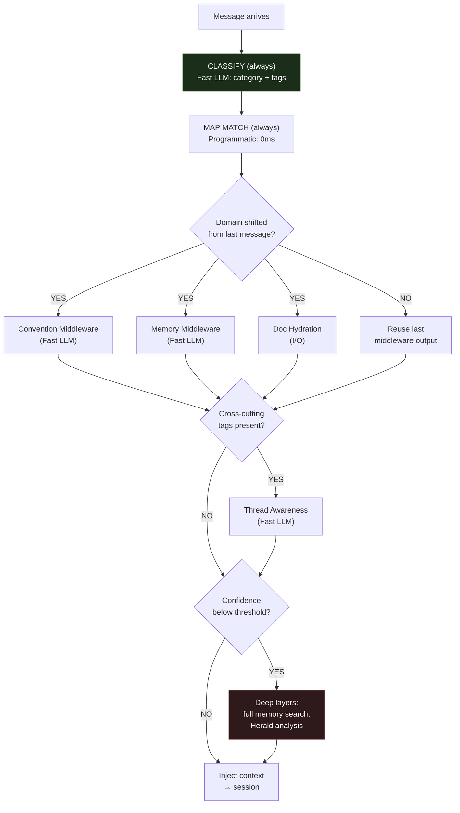
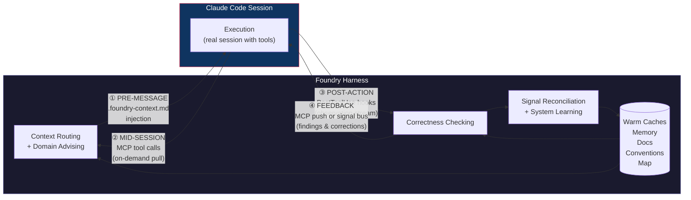
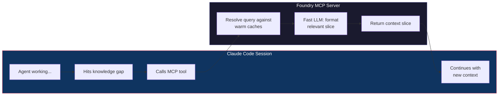
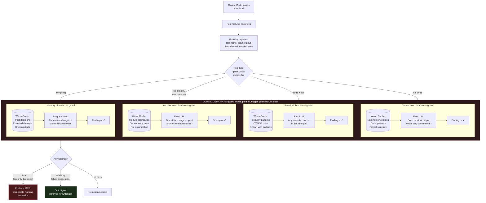
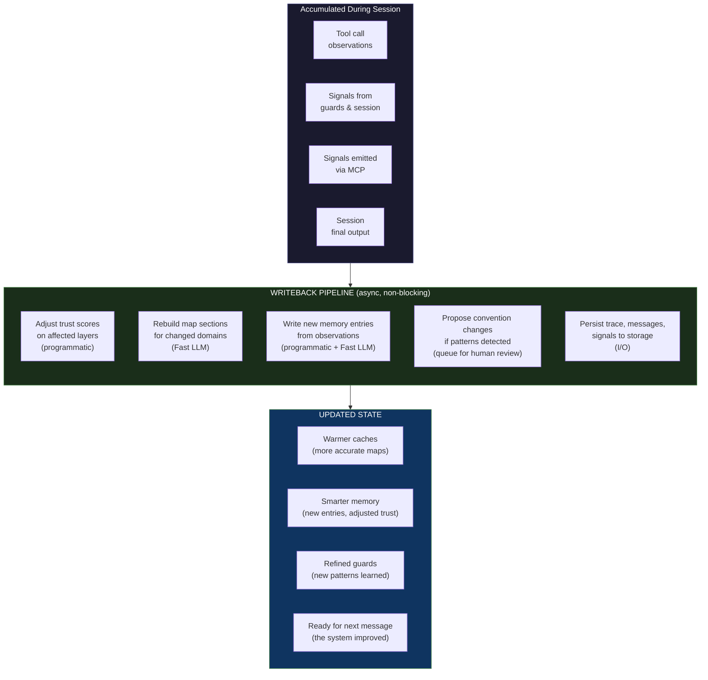
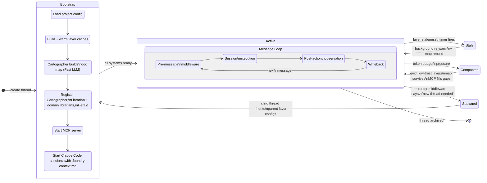

# Foundry Harness — Data Flow & Request Lifecycle

> Northstar document. This is how data and requests move through the Foundry harness.
> Every design decision traces back to two constraints: **token budget** and **latency**.
> Every architectural choice answers one question: **how does the system get smarter after each interaction?**

---

## Why This Exists

Every time an AI agent starts a task, it re-learns what you already taught it. Your conventions, your architecture decisions, your taste — none of it persists reliably. You correct the same mistake on Tuesday that you corrected on Monday.

This is the **re-alignment tax**: the continuous cost of steering AI agents back to what "good" means in your specific context. The tax scales with team size, codebase complexity, and agent autonomy. Today, teams pay it through hand-maintained CLAUDE.md files, scattered system prompts, and vibes.

Three layers exist in AI-assisted work:
- **Model** — frozen weights. You can't change them. Gains are plateauing.
- **Harness** — the tool that wields the model. General-purpose. Doesn't know your org.
- **Corpus** — the context that shapes output. This is the only layer where teams have direct control AND where improvements compound.

Foundry treats corpus as the parameters to optimize. The mechanism is signal infrastructure: **capture** every interaction, **classify** it (correction, convention, taste, ADR, security), **route** it to durable forms, **verify** the change improves output, **prevent regression**. One interaction produces many downstream artifacts — a correction becomes a memory entry, a convention proposal, a guard pattern, a fixture candidate. The system gets smarter after every interaction, not just when someone edits a config.

The goal is not more autonomy. It's **horizon alignment** — making the agent's output converge toward the project's standards, conventions, and accumulated taste. Autonomy without alignment is just faster drift.

---

## The Core Model

Foundry is a nervous system wrapped around a Claude Code session.

Claude Code does what it's already good at — tool use, file access, codebase reasoning. Foundry adds what it doesn't have: persistent memory, project conventions, multi-thread awareness, correctness checking, and an observation loop that makes everything smarter over time.

### The five roles in the flow

The harness has five roles, defined by *where they show up* in the message lifecycle. Each role can be one agent or many — that's an implementation decision, not an architecture one.

```
MESSAGE ARRIVES (user or system)
       │
       ▼
┌─ 1. CONTEXT ROUTING ─────────────────────────────────────────────┐
│                                                                    │
│  Read the topology map. Decide what context slices this message    │
│  needs. Route, never modify. See the whole project so the          │
│  executor doesn't have to.                                         │
│                                                                    │
│  → "This message needs auth-conventions and security-patterns"     │
└────────────────────────────────────────────────────────────────────┘
       │
       ▼
┌─ 2. DOMAIN ADVISING ─────────────────────────────────────────────┐
│                                                                    │
│  Each domain checks its warm cache against the message.            │
│  Docs: which docs to hydrate. Conventions: which rules apply.      │
│  Security: any security context. Memory: have we seen this before. │
│  Cross-thread: any sibling threads relevant or conflicting.        │
│                                                                    │
│  → merged context injected into .foundry-context.md               │
└────────────────────────────────────────────────────────────────────┘
       │
       ▼
┌─ 3. EXECUTION ───────────────────────────────────────────────────┐
│                                                                    │
│  The real agent does the real work. Full tool access, real          │
│  codebase reasoning. This is the expensive model.                  │
│                                                                    │
│  If it discovers a gap mid-work → pulls from context routing       │
│  and domain advisors via MCP bridge (on demand).                   │
└────────────────────────────────────────────────────────────────────┘
       │
       ▼
┌─ 4. CORRECTNESS CHECKING ────────────────────────────────────────┐
│                                                                    │
│  After tool calls, domain agents switch to guard mode.             │
│  Trigger-gated: file-write → convention check,                     │
│  code-write → security check, cross-module → architecture check,   │
│  any action → memory pattern match (programmatic, free).           │
│                                                                    │
│  Critical finding → push immediately via MCP to session.           │
│  Advisory finding → emit signal for reconciliation.                │
└────────────────────────────────────────────────────────────────────┘
       │
       ▼
┌─ 5. SIGNAL RECONCILIATION & SYSTEM LEARNING ─────────────────────┐
│                                                                    │
│  Consume ALL signals from every role. Classify by type             │
│  (correction, convention, taste, ADR, security). Reconcile         │
│  into the thread-state layer (one coherent view, one writer).      │
│                                                                    │
│  Post-execution: trust adjustments, map rebuilds, memory           │
│  entries, convention proposals → feeds the corpus pipeline.        │
│                                                                    │
│  Every execution is a training step. This is the gradient.         │
└────────────────────────────────────────────────────────────────────┘
```

### Roles → agents (current naming)

These are the agents we've named so far. Each implements one or more roles. The roles are the architecture; the agents are one way to fill them.

| Role | Agent(s) | Notes |
|------|----------|-------|
| **Context routing** | Cartographer | Reads everything, owns the topology map, routes slices. |
| **Domain advising** | Domain Librarians (docs, convention, security, architecture, memory) | Each maintains a warm cache for its domain. Advise mode: "what context does this message need from my domain?" |
| **Domain advising** (cross-thread) | Herald | Watches all threads. Detects convergence, divergence, resource conflicts. |
| **Execution** | Claude Code Session | The real work. Full tool access, capable model. |
| **Correctness checking** | Domain Librarians (guard mode) | Same agents as advising, different mode. Guard mode: "did this action violate anything in my domain?" |
| **Signal reconciliation** | Librarian | Sole writer to thread-state. Classifies signals, reconciles, trigger-gates guards, feeds writeback. |

A role can compose many subagents — the Librarian might delegate security checking to three specialized subagents, the Cartographer might have a doc-map builder and a dependency-graph builder underneath. The flow doesn't change. What matters is that after a tool call, *something* checks conventions, *something* checks security, and the results flow into *one* reconciliation point.

### Domain librarians — the shared pattern

Each domain librarian maintains knowledge, advises when asked, and guards when triggered:

| Domain | Warm Cache | Advise (on message) | Guard (on tool call) |
|--------|-----------|--------------------|--------------------|
| **Docs** | Doc map + full content | "Which docs does this message need?" | "Did this edit invalidate any docs?" |
| **Convention** | Naming/pattern rules | "Which conventions apply here?" | "Does this edit violate conventions?" |
| **Security** | Security patterns, OWASP | "Any security context to inject?" | "Does this change introduce a vuln?" |
| **Architecture** | Module boundaries, deps | "Cross-module work?" | "Does this respect boundaries?" |
| **Memory** | Past decisions, failures | "Have we seen this before?" | "This pattern failed last time" |

Memory is special in guard mode: **programmatic pattern matching** against known failure modes (grep + structured memory, not LLM reasoning), so it runs on every tool call for free. All other guards require a Fast LLM call and are trigger-gated.

### Why correctness checking matters more as sessions grow

As context fills, agents become more random — instruction-following decays, earlier context gets diluted, the model starts drifting from conventions it was following at message 5. The guard-mode agents don't degrade with session length because they compare tool outputs against their own warm caches, which are stable and compact regardless of how large the session context has grown. At message 50, the security check compares against the same patterns it had at message 1.

The guards are the mechanism that keeps the session aligned as context pressure mounts. This is the "horizon alignment over autonomy" principle in practice — not making the agent more autonomous, but keeping it aligned with project standards even as its context degrades.

When debugging:
- Wrong conventions injected? → **Convention domain** (bad cache or wrong match)
- Security issue slipped through? → **Security domain** (missed it or wasn't triggered)
- Incoherent thread state? → **Reconciliation** (bad signal merge)
- Duplicate work across threads? → **Cross-thread awareness** (didn't detect convergence)

---

## Design Principles

1. **Don't reinvent Claude Code.** It already has tool use, file discovery, and codebase reasoning. Wrap it, don't replace it.
2. **Middleware = LLM-backed decision slices.** Each middleware consumes a warm cache + the message and produces a decision. That's an LLM call, not a boolean check. The warm cache is the *input* to the call, not a substitute for it.
3. **Cheap models for decisions, capable models for work.** Context routing, domain advising, and correctness checking all use Haiku/Flash. The executor session uses whatever Claude Code is running.
4. **Pull over push.** Don't frontload every possible context. Inject what the middleware predicts is needed, let the session pull the rest via MCP.
5. **Progressive depth, not blanket evaluation.** Basic layers run every message. Deeper layers run only when something changes — domain shift, confidence drop, new trigger. Most steady-state messages hit only classification + map match. The system escalates to deeper middleware and guards based on what the basic layers detect.
6. **Backpropagation is the whole point.** Every execution updates caches, trust scores, and maps. The system improves after every interaction, not just when someone edits a config.
7. **Grep is always available.** When a summary says "this might be relevant" but isn't sure, programmatic search resolves it without an LLM call.

---

## Model Routing

| Flow role | Model Tier | Examples | Why |
|-----------|-----------|----------|-----|
| Context routing | Fast/Cheap | Haiku, Gemini Flash | Map lookup + routing decision |
| Domain advising | Fast/Cheap | Haiku, Gemini Flash | Small context, structured output |
| Execution | Capable | Whatever Claude Code runs | The real work |
| On-demand context (MCP) | Fast/Cheap | Haiku, Gemini Flash | Cache lookup + formatting |
| Correctness checking | Fast/Cheap | Haiku, Gemini Flash | Narrow slice, yes/no + reasoning |
| Signal reconciliation | Mostly programmatic | (rarely) Haiku, Gemini Flash | Reducer logic, LLM only on genuine conflicts |
| Map building/rebuild | Fast/Cheap | Haiku, Gemini Flash | Summarization task |

---

## Progressive Depth — Tiered Frequency Model

Not every layer runs on every message. Not every guard runs on every tool call. The system escalates from cheap/fast basics to expensive/deep analysis only when something triggers it.



### Middleware tiers

| Tier | What runs | Trigger | Steady-state frequency |
|------|-----------|---------|----------------------|
| **Always** | Classification + map match | Every message | Every message |
| **On domain shift** | Convention, memory, doc hydration middleware | Classification output differs from last N messages | ~20% of messages in a focused session |
| **On cross-cutting signals** | Thread awareness middleware | Classification tags indicate multi-domain or shared-resource work | ~5% of messages |
| **On low confidence** | Deep memory search, Herald analysis, full map rebuild | Basic layers return low-confidence or empty results | ~2% of messages |

### Guard tiers

| Guard | Trigger | Skips |
|-------|---------|-------|
| Convention Guard | File-write tool calls | Reads, bash commands, grep |
| Security Guard | Code-write tool calls | Reads, non-code file edits |
| Architecture Advisor | File creation or cross-module imports | Edits within same module |
| Memory Advisor | Always (programmatic pattern match, ~0ms) | Never — it's free |

### The thread-state layer makes this work

The tiered model requires every middleware predicate to answer "should I run?" That question requires knowing what the thread already knows — current domain, what's in context, recent activity. If each middleware independently reconstructs this from dispatch logs, you've defeated the purpose of tiering.

The solution: one of the warm caches IS the thread summary. A thread-state layer (~200-500 tokens, always warm) that the writeback loop keeps current:

```
Thread State Layer:
{
  "domain": "auth",
  "recentActivity": ["edited auth/middleware.ts", "read auth/service.ts"],
  "inContext": ["auth-conventions", "security-patterns"],
  "lastClassification": { "category": "feature", "tags": ["security", "api"] },
  "messageCount": 12,
  "compactionState": "none"
}
```

Every predicate becomes a cache read:
- **"Domain shifted?"** → `threadState.domain !== currentClassification.category`
- **"Need thread awareness?"** → check `recentActivity` for cross-module patterns
- **"Convention guard relevant?"** → tool call touches files outside `threadState.domain`

No LLM calls, no dispatch log scanning. The awareness layer IS the state. This is why awareness layers must be first-class primitives — they're not a dashboard feature, they're the mechanism that makes the entire tiered system efficient.

### One writer, many readers

Multiple domain librarians, guards, and the Herald run in parallel — all producing signals. But only **one entity writes the thread-state layer**: the Librarian.

```
Parallel agents (readers + signal emitters):
  Classification ──────→ { category: "feature", tags: ["security"] }
  Convention Librarian ─→ "auth conventions applied"
  Security Librarian ───→ "clean"
  Architecture Librarian → "cross-module edit detected"
  Herald ───────────────→ "thread B editing same file"
  Tool observation ─────→ "edited auth/middleware.ts"
           │
           ▼
Librarian (sole writer):
  Consumes all signals → reconciles into one coherent state
  Writes → thread-state layer
```

Why sole writer matters:
- **Coherence** — the layer is always a consistent snapshot, never a race between parallel writers
- **Reconciliation** — when classification says "auth" but the Architecture Librarian says "cross-module," the Librarian reconciles: `{ domain: "auth", flags: ["cross-module"] }`. That's a judgment call, not last-write-wins.
- **Predicates stay simple** — every domain librarian reads one coherent state

The Librarian is mostly a programmatic reducer: last classification wins for domain, append-only for activity, union for flags. It only needs a Fast LLM call when signals genuinely conflict and need reconciliation — which is rare in a focused session.

### Session Store vs Thread-State Layer

These are two different data structures serving two different purposes. They are connected but not the same thing.

```
SESSION STORE (append-only event log, grows with session):
  [event] classified: category=auth, tags=[security, api]
  [event] dispatched: executor on auth/middleware.ts
  [event] tool_call: file_write auth/middleware.ts
  [event] sentinel: convention guard clean
  [event] sentinel: security guard flagged SQL injection
  [event] signal: correction emitted
  [event] classified: category=auth (same domain)
  [event] dispatched: executor on auth/service.ts
  ... (hundreds of events over a session)

THREAD-STATE LAYER (materialized view, always compact ~200-500 tokens):
  {
    "domain": "auth",
    "messageCount": 12,
    "inContext": ["auth-conventions", "security-patterns"],
    "flags": ["security-concern-active"],
    "compactionState": "none"
  }
```

| | Session Store | Thread-State Layer |
|---|---|---|
| **Pattern** | Append-only log | Materialized view |
| **Size** | Grows with session | Fixed ~200-500 tokens |
| **Writer** | Everyone appends events | Librarian only (rewrite) |
| **Readers** | `Thread.fromSession()` for replay/restart | Middleware predicates (0ms reads) |
| **Persistence** | Must survive crashes | Reconstructable from store |
| **Compaction** | Can be trimmed/archived | Always current, never compacted |

**The Librarian connects them.** It reads from the Session Store (the raw event stream) and rewrites the Thread-State Layer (the compact view). Each reconciliation is itself an event appended to the store — so the store contains the full history of how the thread-state evolved.

**The Thread-State Layer is derivable.** If you lose it, the Librarian replays the Session Store and rebuilds it. But you'd never want to — it's always warm, always current. That's the whole point.

**Thread restart = store replay.** `Thread.fromSession(store, sessionId)` replays the store to reconstruct warm caches, thread-state, and dispatch history. Same hydration pattern as layers, applied to the whole thread. User closes terminal, comes back tomorrow → thread resumes, not cold-starts.

### Why this works

Most consecutive messages in the same thread are about the same topic. If messages 5 through 12 are all about auth middleware, the convention/memory/doc middleware output from message 5 is still valid at message 12. Re-running it is waste.

The classification tier is always cheap (~200ms, one Fast LLM call). It's the gatekeeper — but it doesn't decide alone. It compares its output against the thread-state layer (0ms read) to determine whether downstream middleware needs to fire.

**Cost impact:** A 50-message session where 80% of messages reuse cached middleware output runs ~10 middleware stacks instead of 50. At Flash rates, that's $0.04 instead of $0.20. Already cheap, now cheaper.

---

## The Four Communication Channels

Every interaction between Foundry and the executor session flows through one of four channels:



| Channel | Flow roles | Direction | Mechanism | When | Latency |
|---------|-----------|-----------|-----------|------|---------|
| ① Pre-message | Context routing + domain advising | Foundry → Session | `.foundry-context.md` injection | Before session starts or on new message | ~400ms |
| ② Mid-session | On-demand context (execution pulls) | Session → Foundry | MCP tools | Agent discovers a gap mid-work | ~200ms per query |
| ③ Post-action | Correctness checking | Session → Foundry | PostToolUse hooks | After every tool call | ~0ms (async capture) |
| ④ Feedback | Correctness checking → execution | Foundry → Session | MCP push or queued for next message | When guards flag something | ~200-500ms |

---

## Loop 1: Pre-Message — Context Routing + Domain Advising

When a message arrives, context routing and domain advising run to contextualize before the executor sees it.


### Middleware execution model

Each middleware:
1. **Has a warm cache** — semi-static state that was pre-loaded (docs index, conventions, memory entries, thread summaries). These are the context layers from the existing system.
2. **Gets the message** — the user's request or system event.
3. **Makes an LLM call** — cheap/fast model compares the message against its warm cache to produce a decision. This IS the classification/routing work, distributed across middleware.
4. **Produces output** — a structured decision (which docs to load, which conventions apply, which memory is relevant, whether sibling threads matter).

Middleware can run in parallel when independent. Doc awareness and convention middleware don't depend on each other. Thread awareness might depend on classification output if you want to narrow the search.

### What "warm cache" means concretely

A warm cache is **not** the full content of every doc or every memory entry. It's a **summarized, structured index** built by a fast LLM at bootstrap and refreshed on change:

```
Doc Map Cache (~500 tokens):
{
  "auth": { "layers": ["auth-conventions", "auth-api-docs"], "size": "9.2k tokens", "lastUpdated": "2h ago" },
  "testing": { "layers": ["test-patterns", "fixture-guide"], "size": "4.1k tokens", "lastUpdated": "1d ago" },
  "security": { "layers": ["security-patterns", "owasp-checklist"], "size": "6.3k tokens", "lastUpdated": "3h ago" }
}
```

The middleware LLM sees this compact index + the message and says "pull auth-conventions and security-patterns." It doesn't see 20k tokens of full docs — it sees 500 tokens of map and makes a routing decision.

When the router says "pull auth-api-docs," that layer gets hydrated (file I/O, not LLM) and injected into the context file.

---

## Loop 2: Mid-Session Bridge (MCP)

The Claude Code session has a minimal MCP server that connects it back to Foundry. When the agent discovers it needs context that wasn't frontloaded, it pulls.



### MCP Tool Surface (minimal)

```
foundry.query(topic: string, detail?: "summary" | "full")
  → "What do you know about [topic]?"
  → Hits map, returns matching layer content
  → detail="summary" returns the map entry (~50 tokens)
  → detail="full" hydrates and returns the actual layer (~1-8k tokens)

foundry.conventions(domain: string)
  → "What are the conventions for [domain]?"
  → Returns matching conventions from warm cache

foundry.memory(query: string)
  → "Have we seen [pattern] before?"
  → Searches memory systems, returns relevant entries

foundry.threads()
  → "What are other threads working on?"
  → Returns session manager summary of active threads

foundry.signal(kind: string, content: string)
  → "I found something important"
  → Emits directly into signal bus — immediate, not deferred
  → Kinds: "missing_context", "wrong_convention", "security_concern",
           "architecture_observation", "correction"
```

### Why MCP solves mid-session injection

The old problem: Foundry can't pause a running Claude Code session to inject context.

The MCP solution: Foundry doesn't need to. The session asks for what it needs, when it needs it. The agent is already good at recognizing knowledge gaps ("I need to check the auth conventions") — MCP gives it a way to resolve those gaps without grepping through files and hoping.

The MCP tools show up in the Claude Code session as available tools alongside file read/write, bash, etc. The agent uses them naturally as part of its reasoning.

---

## Loop 3: Post-Action — Correctness Checking

Tool calls from the Claude Code session fire PostToolUse hooks. Foundry captures these observations and runs correctness checks — but not all checks on every call. Guards are trigger-gated by the reconciliation layer.



### Same librarians, two modes

There's no separate "guard" agent type. The same domain librarians that advise pre-message also guard post-action. The Librarian coordinates both modes — deciding what to fire and when.

| | Advise mode (pre-message) | Guard mode (post-action) |
|---|---|---|
| **Runs when** | Before session starts (tiered by domain shift) | After matching tool calls (trigger-gated by Librarian) |
| **Input** | User message + warm cache | Tool call observation + warm cache |
| **Output** | Context to inject | Finding (or all-clear) |
| **Urgency** | Blocking (session waits) | Non-blocking (async, except critical) |
| **Gating** | Classification domain shift | Tool call type (file-write, code-write, etc.) |

Guard mode is trigger-gated by the Librarian: a file-read doesn't fire the Convention Librarian's guard, a bash command doesn't fire the Security Librarian. This means a session that does 50 tool calls but only 15 are file-writes runs convention guard 15 times, not 50. The Memory Librarian is the exception — it's programmatic pattern matching, so it runs on everything for free.

**Why the guard layer matters:** As a session grows and the context window fills, agents become more random. The guard-mode librarians don't degrade with session length because they compare tool outputs against their own warm caches — stable, compact, independent of the session's growing context. At message 50, the Security Librarian is comparing against the same security patterns it had at message 1. The guards are the mechanism that keeps the session aligned as context pressure mounts.

When a domain librarian in guard mode finds something:

- **Critical findings** (security, breaking changes) → push immediately via MCP into the session. The agent sees it as a tool result: "Security Librarian: SQL injection risk in the query you just wrote on line 42 of auth/service.ts"
- **Advisory findings** (style, suggestions) → emit as signals to the Librarian. The session doesn't see them immediately, but they feed into writeback and will inform future advise-mode decisions.

### The Memory Librarian is special

Unlike the other domain librarians, the Memory Librarian doesn't necessarily need an LLM call in guard mode. It does **programmatic pattern matching** against known failure modes:

- "The last time someone edited this file and used that pattern, it was reverted in PR #847"
- "This function signature was changed 3 times in the last month — it's unstable"
- "A similar approach was tried in thread-feature-auth and abandoned"

This is grep + structured memory, not LLM reasoning. Fast and free.

---

## Loop 4: Writeback — Signal Reconciliation + System Learning

After the session completes (or periodically during long sessions), Foundry processes all accumulated signals and observations to improve its state. This is where the gradient gets applied to the corpus.



### What writeback concretely updates

| What | How | Trigger |
|------|-----|---------|
| **Layer trust scores** | Layer that provided useful context → trust++ ; layer whose content was contradicted → trust-- | Every execution |
| **Doc map** | If a layer's content changed (agent edited a file that's a layer source), rebuild that map section | File-change observation |
| **Memory entries** | New observations become memory entries: "auth module uses middleware pattern X" | Guards + session signals |
| **Convention proposals** | If the same correction appears 3+ times, propose it as a formal convention | Signal frequency threshold |
| **Guard caches** | New security patterns, new architecture boundaries discovered during session | Guard findings + session observations |
| **Thread summaries** | Update this thread's summary so other threads' middleware can see what happened | Session completion |

### Why writeback matters

Without writeback, every session starts from the same baseline. With writeback:
- The doc map gets more accurate (middleware makes better frontloading decisions)
- Memory accumulates (the MCP returns richer results)
- Guards learn new patterns (fewer false negatives over time)
- Trust scores reflect reality (compaction evicts the right things)

This is the gradient descent on corpus from the vision doc — every execution is a training step.

---

## Thread Lifecycle

How a Foundry thread (wrapping a Claude Code session) moves through its lifecycle.



### Cold start vs steady state

**Cold start (~2-5s):**
- Build all layer caches (parallel I/O)
- Build doc map (one Fast LLM call)
- Start MCP server
- Start Claude Code session with injected context
- First message has full middleware overhead

**Steady state (~400ms overhead per message):**
- Caches are warm, map is built
- Middleware runs against warm caches (parallel Fast LLM calls)
- Session is already running
- MCP server is ready for pulls
- Guards are watching the tool stream

**After compaction:**
- Low-trust layers evicted, but map survives
- If the session needs evicted content, MCP can pull it on demand
- Writeback from that MCP pull may trigger trust re-evaluation (maybe that layer shouldn't have been evicted)

---

## Complete Decision Reference

Every branching point in the system, who decides, and how.

| Decision | Flow role | Agent | Model | Input | Speed |
|----------|----------|-------|-------|-------|-------|
| What context slices does this message need? | Context routing | Cartographer | Fast LLM | Message + topology map | ~200ms |
| Which docs to hydrate? | Domain advising | Docs Librarian | Fast LLM | Message + doc map cache | ~200ms |
| Which conventions apply? | Domain advising | Convention Librarian | Fast LLM | Message + convention cache | ~200ms |
| Any relevant memory? | Domain advising | Memory Librarian | Fast/Programmatic | Message + memory index | ~0-200ms |
| Sibling threads relevant? | Domain advising | Herald | Fast LLM | Message + thread summaries | ~200ms |
| Session needs context mid-work? | Execution (MCP) | Cartographer | Fast LLM | Query + map | ~200ms |
| Does this edit violate conventions? | Correctness checking | Convention Librarian | Fast LLM | Observation + convention cache | ~200ms |
| Security concern in this change? | Correctness checking | Security Librarian | Fast LLM | Observation + security cache | ~200ms |
| Does this respect architecture? | Correctness checking | Architecture Librarian | Fast LLM | Observation + architecture cache | ~200ms |
| Seen this pattern fail before? | Correctness checking | Memory Librarian | Programmatic | Observation + failure mode index | ~0ms |
| Which guards fire on this tool call? | Correctness checking | Librarian | Programmatic | Tool call type | 0ms |
| Push finding or defer? | Correctness checking | Librarian | Programmatic | Finding severity | 0ms |
| Reconcile signals into thread state | Signal reconciliation | Librarian | Programmatic (rarely Fast LLM) | All signals | ~0ms |
| Layer stale? | System learning | Staleness timer | Programmatic | `lastWarmed + staleness` | 0ms |
| What to evict under budget pressure? | System learning | Trust scores | Programmatic | Sorted trust, compaction strategy | 0ms |
| Convention promotion? | System learning | Librarian → human review | Human | Signal frequency + confidence | Async |

---

## Failure Modes

| Flow role | Failure | Impact | Recovery |
|-----------|---------|--------|----------|
| Context routing | Classification is wrong | Wrong layers frontloaded | Session's own reasoning + MCP correct for it; writeback captures the miss for next time |
| Domain advising | Advise LLM call fails | Missing context injection for that domain | Session proceeds with partial context; MCP available for on-demand pulls; retry in background |
| Domain advising | Layer fails to warm | Domain has empty cache | Domain knows its cache is cold and says so; session relies on MCP + native tools |
| Execution | Claude Code session crashes | Work interrupted | Foundry has full observation log; can restart session with context rebuilt from Session Store |
| Execution (MCP) | MCP server unavailable | Session can't pull on-demand context | Session falls back to native Claude Code tools (grep, file read); degraded but functional |
| Correctness checking | Guard LLM call fails | Missed finding for one observation | Other guards still running; that guard retries on next observation; signal emitted so writeback knows |
| Signal reconciliation | Fast LLM unavailable | Reconciliation and advising stall | Fall back to programmatic heuristics (keyword match against map, default routing); degrade gracefully |
| System learning | Token budget exceeded | Can't fit all matched layers | Evict by trust score; map always survives; MCP fills gaps on demand |
| System learning | Memory backend down | No persistent memory | Thread-local observations still available; file-based caches still warm; memory writes queue for retry |

---

## What Exists vs What Needs Building

### Already exists in the codebase
- Context layers with warm/stale lifecycle and trust scores
- Context stack with budget-aware assembly
- **ContextStackView** — read-only stack introspection for middleware (`ctx.stack.hasLayer()`, `ctx.stack.getContent()`) — this is what makes the tiered predicate model work without dispatch log scanning
- Middleware chain with tiered execution (always/conditional via `useWhen()`)
- **Retry middleware** — composable exponential backoff with jitter, configurable retryability (excludes permission denials and budget errors)
- **Permission middleware** — integrates CapabilityGate into dispatch pipeline, provider-agnostic allow/deny/ask
- **Message idempotency** — BoundedSet-based dedup at harness ingress, opt-in with configurable capacity
- Signal bus with typed pub/sub
- Session manager with thread spawning and blueprints
- Trace system with full span tree
- ClaudeCodeRuntime with `.foundry-context.md` injection and PostToolUse hook scripts
- ClaudeCodeProvider (currently `-p` mode, needs evolution)
- Compaction strategies (trust-based, LRU, summarize, hybrid)
- Herald cross-thread pattern detection
- Capability gate with policy system (UNATTENDED, SUPERVISED, RESTRICTED) and ActionQueue for human-in-the-loop prompts

### Built
- **MCP server** — 5 tools (query, conventions, memory, threads, signal). Mid-session bridge for on-demand context. `packages/foundry/src/mcp/`
- **Librarian** — signal reconciliation coordinator. Sole writer to thread-state layer. Consumes all signals, reconciles into coherent state. `packages/foundry/src/agents/librarian.ts`
- **Thread-state layer** — compact (~200-500 token) materialized view. Updated by Librarian after every signal. Contains domain, recent activity, in-context layers, flags.
- **Domain Librarian framework** — shared advise + guard pattern. Each domain maintains a warm cache, advises on incoming messages, guards on tool calls. Programmatic guard path for Memory domain. `packages/foundry/src/agents/domain-librarian.ts`
- **Cartographer** — context routing role. Builds topology map from stack, routes messages to the right layers via fast LLM call, keyword fallback when LLM unavailable. `packages/foundry/src/agents/cartographer.ts`

### Needs to be built
- **Real session management** — evolve ClaudeCodeProvider from `-p` one-shot to persistent session wrapper. Manage session lifecycle (start, observe, inject, restart).
- **Guard trigger-gating orchestration** — wire the Librarian to route PostToolUse observations to domain librarians based on tool call type. The pieces exist (Librarian + DomainLibrarian.shouldGuard()) but aren't wired end-to-end with the hook system.
- **Writeback pipeline** — post-execution signal processing. Connects to the corpus compilation pipeline (VISION.md §7): Librarian reconciles signals → trust adjustment → Docs Librarian rebuilds map sections → Memory Librarian writes new entries → convention proposals queue as fluid corpus entries → promoted to formal docs after batched human review → compiled into optimized corpus snapshots. The pieces exist separately but aren't wired as a coherent post-session flow.
- **Model routing per role** — enforce cheap models for all domain librarians (advise + guard modes) and the Librarian's signal processing, capable models for execution. The provider system supports per-agent models but the harness doesn't enforce the routing pattern.
- **Concrete domain librarian instances** — instantiate DomainLibrarian for each domain (docs, convention, security, architecture, memory) with domain-specific prompts, guard triggers, and warm cache strategies.

---

## How Writeback Connects to the Corpus Pipeline

The writeback pipeline (Loop 4) feeds into the three-stage corpus compilation pipeline described in VISION.md:

```
Loop 4 outputs:                    Corpus pipeline:
                                   
  Trust score adjustments ───────→ Compiled corpus (layer weights)
  Memory entries ────────────────→ Fluid memory (raw signals)
  Convention proposals ──────────→ Fluid → Formal (after human review)
  Map rebuilds ──────────────────→ Compiled corpus (routing accuracy)
  Guard patterns learned ────────→ Fluid → Formal (domain librarian caches)
```

**Fluid** — raw signals, corrections, observations. High volume, unstructured. This is where writeback outputs land. The Librarian classifies them.

**Formal** — conventions docs, ADRs, skill definitions. Structured, versioned, attributed. Signals promoted here after batched human review (VISION.md §8). Each entry traces back to the signal that created it.

**Compiled** — the effective context the session receives. Assembled from formal docs + layer trust scores, deduplicated, optimized for token efficiency. Immutable snapshots with content hashes for reproducibility.

Every execution is a training step on the corpus. Writeback is the gradient. The corpus pipeline is where the gradient gets applied.

---

*This document is the logical skeleton for Foundry's harness architecture. Implementation PRs should reference specific sections. If a PR can't point to a section here, either the PR is wrong or this document needs updating first.*
