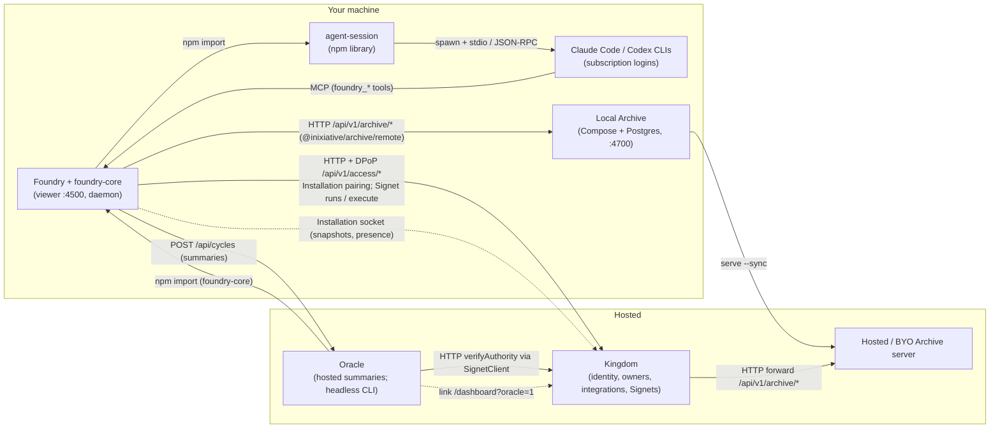

# System map

How the five apps fit together, what each one owns, where the code crosses those lines today, and how far the end-to-end journey works. Evidence is from `origin/main` of each repo on 2026-09-30: Foundry `3a5cf71`, Kingdom `f6a3c790`, Oracle `b961afd`, Archive `ab3f173`, agent-session `320eee1`. `path:line` refers to that repo's `origin/main`.

## 1. Big picture

You work in **Foundry**, which runs on your own machine. Foundry wraps the native agent CLIs (Claude Code, Codex) with specialized contexts and middleware (decision roles), so the main thread stays small and you stop repeating yourself. It runs those agents through **agent-session**, which owns native sessions, transports, subscription pools, routing, limits and continuity. Foundry extracts every session into **Archive** (OSS capture, storage and search). An Archive can be local, hosted through Kingdom, or self-hosted (BYO). **Kingdom** is the hosted connector. It owns identity, the five owner classes (personal, organization, space, org-user, space-user), integrations with their credentials, and Signets as structural access gates. Foundries, Archives and Oracle connect through it. Foundry and Kingdom are many-to-many. **Oracle** is the closed evaluation product. It turns merged PRs and sessions into fixtures, runs experiments, and proposes context and middleware changes, with evidence that they help. Kingdom is a connector. Foundry and Oracle are capacities that connect through it.

### Access model: Credential, Token, Signet (Aron, 2026-10-07)

Each of these three does one job, and none stands in for another.

| Layer | Who gives it to whom | What it allows |
|---|---|---|
| **Credential** | The owner gives it to Kingdom, which stores it encrypted on the Integration. | Kingdom calling the provider (GitHub, an Archive server, a model API). It is never handed out. |
| **Token** | Kingdom gives it to a principal (user, org member, space member). | Calling Kingdom's own API with a role. Pure read/write on Kingdom itself. It never reaches an integration's resources. |
| **Signet** | The owner (grantor) grants it to a grantee on one Integration. The grantee is an actor (a person) or an integration (a paired Foundry, Oracle). | Using that integration: resources, operations, lens (documents, fields), limits, expiry and revocation. Its access token or key enrollment is only how the grantee presents it. |

**Anything that uses an integration goes through a Signet.** Foundry is an integration plus a Signet, and so is Oracle. Archive reads and writes are Signet operations on the Archive integration's `archiveLibrary`.

Foundry has no runtime key. It pairs as a Kingdom **Installation** (its own DPoP key): an owner approves the registration, Kingdom creates that owner's `foundry` Integration and the Signet it holds, and Foundry acts only by presenting that Signet and any later grants to the integration.

## 2. The apps

### agent-session (`inixiative/agent-session`, `@inixiative/agent-session` 0.3.0, MIT)
- **Owns:** persistent native sessions (Claude CLI, Claude Agent SDK, Codex MCP, Codex app-server), the normalized event stream, primed decision sessions, subscription pools, deterministic routing, limit polling, and continuity between accounts.
- **Not its job:** context and middleware (Foundry), identity, ownership and credential policy (Kingdom decides which accounts may be used), evaluation (Oracle).
- **Interfaces:** npm library (`HarnessSession`, `createSession`/`TRANSPORTS`, `CodexPrimedSessions`, `SubscriptionPool`). It spawns the agent CLIs.
- **Release:** base of the `agentic` lane of the `@inixiative/config` train.

### Foundry + foundry-core (`inixiative/foundry`, `@inixiative/foundry-core` 0.2.0 MIT, `@inixiative/foundry` 0.2.0 BSL)
- **Owns:** the local workspace. That covers threads, context layers, middleware (decision roles on warm subscription sessions), the capability gate, the viewer and daemon, the MCP server for agents, Kingdom pairing on the client side, runtime jobs, and capture into the local Archive (it keeps no archive store and publishes nowhere; the local Archive publishes onward). It is subscription-only by default (`apiTokens` opt-in).
- **Not its job:**
  - Session transports and pools. It should consume agent-session for these.
  - Identity, owners and Signet issuance (Kingdom).
  - Evaluation, fixtures and experiments (Oracle).
  - Archive storage internals (Archive).
  - Being hosted.
- **Interfaces:**
  - CLI: `start`, `setup`, `doctor`, `kingdom pair|status|disconnect`, `archive …`, `signet …`, `daemon:*`.
  - HTTP and WebSocket viewer on :4500 (`packages/foundry/src/viewer/server.ts:93`).
  - MCP server `foundry` (`packages/foundry/src/mcp/server.ts:228-375`).
  - npm: `@inixiative/foundry/runtime`, which exports the runtime job worker and `SignetClient`.
- **Release:** `agentic` lane, npm.

### Oracle (`inixiative/oracle`, `@inixiative/oracle` 0.1.0, private)
- **Owns:** fixtures (merged PRs, mined sessions), corrections mined from transcripts, scoring, diagnosis, batch comparison (CI-gateable), experiments and cycles, and improvement proposals for corpus, context and middleware. It runs headless first, with a hosted summary viewer.
- **Not its job:**
  - Running native agents or holding subscription credentials. Execution should use Foundry and agent-session capacity.
  - Identity and authorization (Kingdom).
  - Its machinery living in Kingdom or Foundry.
- **Interfaces:**
  - CLI `oracle init|extract|mine|run|capture|artifacts|score|compare|trends|gaps|suggestions`.
  - `oracle-worker`.
  - Hosted HTTP: `/api/batches`, `/api/cycles`, `/api/adaptive-cycles` (`src/hosted/server.ts:128-210`).
  - Artifact JSON in `.oracle/artifacts/` as the interchange format with Foundry.
- **Release:** private consumer on the `agentic` lane. It ships as a Docker image. It has no CI (there is no `.github/`).

### Archive (`inixiative/archive`, `@inixiative/archive` 0.5.1, MIT)
- **Owns:** capturing Claude Code, Codex and ChatGPT-export histories, immutable SQLite revisions, lexical search, and the standalone authenticated server (Docker, Compose, Railway, Render). It also owns destinations and sync, and launchd/systemd collector agents.
- **Not its job:** multi-user sharing and accounts (Kingdom), deciding what to capture from a live Foundry thread (Foundry).
- **Interfaces:**
  - CLI `archive init|serve|connect(setup)|collect|sync|search|agents …`.
  - HTTP `/health` and `/api/v1/archive/{ingest,read,search}` (`src/server.ts:35-74`).
  - npm subpath exports.
- **Release:** `primitives` lane, npm.

### Kingdom (`inixiative/kingdom`, not published)
- **Owns:** accounts and identity, the five-way owner, integrations (credentials live on the integration), Signets as the only grant for using an integration (Foundry and Oracle included), the hosted Archive browser (Archive is an owner integration; shares are Signets), and the dashboard where Foundries, Archives and Oracle are connected.
- **Not its job:** Oracle experiment machinery, Foundry runtime machinery, agent-session capacity machinery, demos, and Archive storage internals that duplicate Archive.
- **Interfaces:**
  - HTTP `POST /api/v1/<module>/<action>` (`apps/api/src/lib/routeTemplates/action.ts:37-44`). This includes `access/*` (runtime, Signets, runs, Oracle cycles), `archive/*` (`ingest`, `list`, `read`, `search`, forwarded to the owner's Archive integration), `owner/*` (owner dashboard) and `integration/*`.
  - A generic WebSocket pub/sub (`apps/api/src/index.ts:37`).
  - No MCP.
- **Release:** a deployed app, a consumer of both lanes (`config/versions.json:37-42`). Foundry's hosted default API is `https://api.kingdom.inixiative.com` (`HOSTED_KINGDOM_URL`, `packages/foundry/src/providers/kingdom-pairing.ts`). The prod schema is applied with `db push`.

## 3. Boundaries violated today

### Kingdom
- **Oracle machinery lives in Kingdom.**
  - Contracts: `packages/access/src/oracleCycle.ts:11,36-70` (presets and a summary schema with `promotion: 'unproved'`), and `packages/access/src/runtimeDelegation.ts:12,14,44` (`oracleAdaptiveExperiment`, `oracle-hosted-controlled/v1`, evaluation limits).
  - Job kinds: `packages/access/src/runtimeJobs.ts:12-17`.
  - Prisma models `runtimeOracleCapacity`, `runtimeOracleCycle`, `runtimeJobDelegation` and `runtimeDelegatedAttempt`.
  - `access` controllers: `accessBeginOracleCycle`, `accessReportOracleCycle`, `accessAdmitOraclePublication`, `accessRegisterOracleCapacity` and more. `owner` controllers: `ownerStartOracleCycle`, `ownerCreateRuntimeDelegation` and more.
  - UI: "Start Oracle experiment" (`apps/web/app/components/owner/OracleCycles.tsx`).
  - Kingdom should know Oracle only as an integration. Today `foundry` and `oracle` are in the `Provider` enum (`packages/db/prisma/schema/integration.prisma:63-78`) but have no catalog entry (`packages/access/src/catalog.ts`).
- **Connection as a term:**
  - `apps/api/src/modules/archive/remoteRoutes.ts:15,35,49,55` (`/remote/connections`, `connectionId`)
  - `packages/db/src/lib/encryption/registry.ts:16,26` (`CONNECTION_SECRETS`)
  - the `renewConnections` job (`apps/api/src/jobs/handlers/index.ts:8`)
  - the `connectionCheck` job kind (`runtimeJobs.ts:13`)
- **Kingdom tests import Foundry source:** `apps/api/src/modules/access/tests/foundrySource.ts:6` resolves a sibling `../foundry` checkout. Kingdom PR #86 reports 2 failing tests because that sibling speaks an older contract. Kingdom should test against the published `@inixiative/foundry/runtime`, not a checkout.
- **Duplicate Archive storage:** resolved in Kingdom `59ee9b8a`. Kingdom's archive tables are gone; Archive is an owner integration through `@inixiative/archive/remote`, and shares are Signets.
- **Backwards-compat path:** `apps/api/src/modules/owner/schemas/ownerSchemas.ts` still accepts legacy `access` policy JSON ("Choose resource grants or legacy access").
- **Process and lab files:**
  - `docs/validation/*.json` (about 30 run logs)
  - `docs/MACHINE-HANDOFF-2026-09-10.md`
  - `docs/RAW_NOTES.md`
  - `docs/ORACLE-EXECUTION-BRIDGE.md:3` ("executes the existing Lab cycle")
  - `docs/WORKSPACE-INTEGRATION-2026-09-21.md` ("Foundry Lab")
- **Unclear owner:**
  - The inference gateway: `apps/api/src/modules/access/services/streamInference.ts:65` proxies API-key calls to Anthropic and OpenAI for run bindings. It overlaps agent-session's capacity routing, and its purpose under subscription-only execution needs a decision.
  - Tribe coupling: the `RuntimeTribeBinding` and `RuntimeTribeAction` models and `modules/owner/services/tribe/*` are bespoke models, not a catalog integration.

### Foundry
- **Oracle product material:**
  - `ARCHITECTURE.md` ("Oracle Eval Team")
  - `PROPOSAL.md:60,319-358` (Oracle service and pricing)
  - `LICENSE:26` ("Foundry Oracle — Proprietary")
  - `docs/THREE_SYSTEMS.md:10,186`
  - `docs/BOUNDARY-BENCHMARK.md`
  - `docs/DISTILLATION.md:39-62`
  - Code in the same area: `mcp/fixture-bridge.ts` (`fixture_read/write/command`) and `providers/native-launch.ts:67-73` (`withIsolatedFixture`, used from `session-adapter.ts:520`). These look like eval-run infrastructure; confirm whether Oracle should own them.
- **Lab and QA material** (the dead `oracle:profile` script, the top-level `fixtures/harness-qa/` handoff notes and the `../foundry-lab` reference were removed in the follow-up cleanup):
  - `docs/validation/*.json`
  - `scripts/native-worker/` (VM prototype)
- **Duplicates agent-session:**
  - `packages/foundry/src/providers/claude-code.ts:146,224` spawns `claude` directly.
  - `providers/codex-text-provider.ts:136` spawns `codex exec` directly.
  - `providers/session-backed.ts:71,85,176` keeps its own warm-session pool.
  - Draft #41 moves decisions onto agent-session primed sessions. agent-session 0.3.0 is now on npm, so it is no longer blocked on the release.
- **Connection as a term:**
  - `providers/kingdom-authentication.ts:97`
  - `providers/connection-check-job.ts`
- **README:**
  - `README.md:50` links a missing `docs/TEAM-READINESS.md`.
  - `README.md:35` lists API providers first.

### Oracle
- **Reaches into Kingdom source:**
  - `scripts/fixtures/authority-consumer.ts:22-38` and `delegation-consumer.ts:40-42` import `apps/api/src/modules/owner/...` from a Kingdom checkout (`KINGDOM_TEST_SOURCE`).
- **Needs Foundry to talk to Kingdom:** Kingdom's client (`SignetClient`) lives in `@inixiative/foundry/runtime`, so Oracle peer-depends on Foundry (`package.json` `peerDependencies`). Its README says "Foundry and Oracle never import each other". A Kingdom client package would remove this.
- **Paid API only:** `src/providers.ts:42,125,174` (Anthropic and Gemini with `ANTHROPIC_API_KEY` / `GEMINI_API_KEY`) is the only way `oracle run` executes. There is no subscription path.
- **One-off records and lab references:**
  - `.oracle/qa/lifecycle-calibration-20260910/*` and `.oracle/qa/zealot-candidates-20260910/*`
  - `docs/MACHINE-HANDOFF-2026-09-10.md`
  - "Lab owns experiment orchestration" (`docs/HOSTED-ORACLE.md:21`)

### agent-session
- **QA handoff notes:** `docs/S1-*.md` (for example `S1-identity-outcome-handoff.md:3`, "submitted for independent QA and Fable read-only review") and the `scripts/s0/*` evidence recorders.

### Archive
- **Connection as a term:** `src/config.ts:42`, `src/client.ts:15-34`, `src/cli.ts:44` and `README.md:94` (`--connection-id`, `connectionId`) for Kingdom forwarding.

## 4. End-to-end journey

The acceptance bar is that an agent can drive every step for you. Most steps are already scriptable: `bun run kingdom pair`, `bun run archive setup --yes`, `archive agents install`.

| # | Goal | Status | Owner of the gap |
|---|---|---|---|
| 1 | Run Foundry locally | works | — |
| 2 | Local Archive | works | — |
| 3 | Sign in to Kingdom with owners | works | Kingdom (naming) |
| 4 | Pair Foundry with Kingdom (many-to-many) | partial, broken on main | Kingdom, Foundry |
| 5 | Prompted hosted-Archive setup once hosting is connected | partial | Kingdom, Foundry |
| 6 | Provider connectors (Claude, Codex/OpenAI, Grok, Meta Muse, Gemini, …) | partial | agent-session, Kingdom, Archive |
| 7 | Middleware layers configurable, working, testable | partial | Foundry |
| 8 | Process feedback captured into a middleware layer | missing | Foundry, Oracle |
| 9 | Oracle verifies that layer changes improve outcomes | partial | Oracle, Foundry |

**1. Run Foundry locally: works.**
- `bun run start` serves the viewer on `VIEWER_PORT || 4500` (`packages/foundry/src/start.ts:572`).
- `bun run daemon:install|start` runs it under launchd from `.foundry/releases/<sha>` (`scripts/daemon/supervisor.ts:55`).
- It is subscription-only by default (`packages/foundry/src/start.ts:135-140`, `subscription-policy.ts:38-63`), with `apiTokens` as the opt-in (`viewer/config.ts:32-33`).

**2. Local Archive: works.**
- One local Archive per machine runs in Docker Compose (`archive up`, loopback :4700); `bun run archive setup` starts it. The viewer captures into it over HTTP and retries while it is down.
- `archive agents add-collector … && archive agents install` adds always-on capture of Claude Code and Codex history.
- `bun run archive …` passes every command except `setup` to the Archive CLI.

**3. Sign in to Kingdom with owners: works.**
- The five-way owner landed in Kingdom #80.

**4. Pair Foundry with Kingdom: works (Installation pairing).**
- Foundry pairs as an Installation through `@inixiative/signet` `pairInstallation`: `providers/kingdom-pairing.ts`, `bun run kingdom pair`, Settings → Kingdom. A person approves the review code in Kingdom; Foundry collects the Signet of the owner's new `foundry` Integration.
- Many-to-many: `kingdomIntegrations` holds one entry per Kingdom + owner.
- Liveness and grants ride the Installation socket (`providers/kingdom-installation-connection.ts`): snapshots enroll later grants and drop revoked Signets; the viewer locks when no paired Kingdom lists this Foundry's Signet.
- `bun run kingdom status --config-dir <empty>` returns `{"status":"disconnected","integrations":[]}`.

**5. Prompted hosted-Archive setup once hosting is connected: partial.**
- **What exists:**
  - Foundry's first-run `bun run setup` starts the local Archive and offers Kingdom pairing. Foundry holds no hosted destinations: the local Archive publishes to hosted Archives, which are reached through Kingdom as an integration (Kingdom side not built yet).
- **Kingdom:**
  - On main, remote Archives come only from the operator env `ARCHIVE_REMOTE_BINDINGS` (`apps/api/src/modules/archive/services/remoteArchives.ts:23`).
  - Open PR #86 adds self-service "Connect an Archive server" as an `archiveServer` integration.
- **Missing:**
  - Kingdom has no hosting integration (Railway, Render, …) in its catalog.
  - Nothing notices that hosting is connected and prompts you.
  - Nothing deploys an Archive for you. Archive already ships `Dockerfile`, `render.yaml` and `railway.json`.
  - Pairing from the viewer (Settings → Kingdom) does not lead into archive setup.
- **Gap:**
  - Kingdom: merge #86, add a hosting integration, and add a "set up hosted Archive" prompt that provisions from Archive's deploy templates and stores the server as an integration.
  - Foundry: after pairing in the viewer, surface the same prompt.

**6. Provider connectors: partial.**
- **Subscription (native):** Claude and Codex only.
  - agent-session: transports `claude-cli`, `claude-agent-sdk`, `codex-mcp` and `codex-app-server`. `acp` (the Gemini CLI route) and `api` are stubs (`src/transports.ts:46-65`).
  - Foundry: native runtimes are `"claude" | "codex"` (`providers/native-authentication.ts:13`).
- **API key:** foundry-core registers `gemini`, `meta` (Muse Spark) and `xai` (Grok) (`packages/core/src/model-registry.ts:299,317,344`). They are used only with `apiTokens: true`.
- **Kingdom:** the `Provider` enum has only `anthropic` and `openai` as AI providers, both API-key based (`integration.prisma:63-78`, `catalog.ts:114,123`). There is no per-owner connector for your subscription accounts.
- **Archive:** capture sources are `codex`, `claude-code` and a ChatGPT export.
- **Gap:**
  - agent-session: native transports for Gemini, Grok and Meta Muse where a CLI or ACP exists.
  - Kingdom: one provider integration per account, attached to an owner, that agent-session pools draw from.
  - Archive: capture sources for each new harness.

**7. Middleware layers configurable, working, testable: partial.**
- **Configuration:** layers and agents live in `.foundry/settings.json`, globally and per project (`viewer/config.ts:240-305,335-397`; example `examples/domain-team.settings.json`).
- **Execution:** non-executor agents run as decision roles on the subscription decision profile (`subscription-policy.ts:120`), on warm per-thread sessions (`providers/session-backed.ts:176`).
- **Testing:** there are unit tests, but you cannot test your own layer. There is no test or dry-run command. Inspection is limited to `/api/projects/:id/resolved/layers` and `bun run doctor`.
- **Gap (Foundry):**
  - A `layer test` command that runs a layer's decision role against recorded inputs with expected outcomes. The pattern already exists in `scripts/jev-catalog.ts --cases`.
  - Move decisions onto agent-session primed sessions (#41).

**8. Process feedback captured into a middleware layer: missing.** Design proposal: [FEEDBACK-LOOP.md](FEEDBACK-LOOP.md).
- **What exists:** `POST /api/threads/:threadId/interventions` (`viewer/routes/runtime.ts`) emits a `correction` signal on that thread's bus (`packages/core/src/intervention.ts`). That signal becomes a pinned memory record owned by the thread (`packages/core/src/adapters/file-memory.ts:48`), tied to one trace span.
- **What is not wired:**
  - `RuleCompiler.recompileOn` is declared but never used (`agents/domain-librarian.ts:478`).
  - `CorpusCompiler.ingestFromSignalBus` is never called.
- **Where standing feedback lives today:** hand-maintained `CLAUDE.md` and memory files outside Foundry. Oracle's `oracle mine` extracts corrections from transcripts into `.oracle/corrections.jsonl`, but nothing turns them into a layer.
- **Gap:**
  - Foundry: classify a message as process feedback, write it as a proposed change to a named layer, and apply it on approval, versioned.
  - Oracle: feed mined corrections into the same proposal path.

**9. Oracle verifies that layer changes improve outcomes: partial.**
- **What exists:** extract/mine → run/capture → score → `compare`, which exits non-zero on regression. There is also `src/layer-cycle.ts`.
- **Blockers:**
  - `oracle run` executes only through paid API keys (`src/providers.ts:42,125,174`).
  - Native execution is refused (`src/runtime/handler.ts:83`).
  - Hosted execution is unavailable (`docs/HOSTED-ORACLE.md:3`).
  - Foundry sessions reach Oracle only as manually captured diffs (`oracle capture`).
  - Foundry's `oracle:profile` script is dead.
  - Oracle has no CI.
- **Gap:**
  - Oracle: run a baseline arm and a candidate-layer arm on subscription capacity through Foundry/agent-session, compare them, and attach the evidence to the layer proposal from goal 8.
  - Foundry: emit a `SubjectArtifact` per thread with the injected layer IDs and hash.

## 5. Goals per app

**Kingdom**
1. Done: the owner rename (`modules/owner`, `/v1/owner`, `components/owner`). The runtime key is gone; Foundry pairs as an Installation.
2. Support one Foundry across many Kingdoms and many Foundries per owner, with liveness over the socket (goal 4).
3. Merge #86. Add a hosting integration and the "set up hosted Archive" prompt and provisioning. Pick one hosted Archive path (stored or forwarded) (goal 5).
4. Add per-owner AI provider integrations (Claude, OpenAI/Codex, Grok, Gemini, Meta Muse) that feed subscription pools. Decide what the API-key inference gateway is for (goal 6).
5. Remove the Oracle cycle and delegation machinery and the synthetic demo. Give `foundry` and `oracle` real catalog entries instead. Drop `connectionId`, `CONNECTION_SECRETS`, `renewConnections`, `connectionCheck` and the legacy `access` policy path. Test against published Foundry, not a sibling checkout.

**Foundry**
1. Bind to many Kingdoms (goal 4).
2. After pairing in the viewer, prompt for hosted Archive setup (goal 5).
3. Run decisions on agent-session primed sessions and delete the local spawn and pool code (#41) (goal 7).
4. Add a `layer test` command with recorded cases (goal 7).
5. Capture process feedback as versioned layer proposals (goal 8).
6. Emit Oracle artifacts per thread (goal 9).
7. Move Oracle and lab material out: `ARCHITECTURE.md`, `PROPOSAL.md`, the Oracle LICENSE section, `fixtures/harness-qa/`, `scripts/native-worker/`, the dead `oracle:profile` script, and the Oracle-oriented docs. Drop `--connection-id` and `connectionId`.

**agent-session**
1. Add native transports for Gemini (ACP), Grok and Meta Muse where they have CLIs, and let pools take accounts supplied by Kingdom (goal 6).
2. Serve Foundry's decision roles as the only warm-session implementation (goal 7).
3. Move the S0/S1 handoff notes out of the repo.

**Archive**
1. Add capture sources for each new harness (goal 6).
2. Provide a one-command deploy that Kingdom can drive from a hosting integration (goal 5).
3. Replace `connectionId` with the integration ID, and fix the credential prefix in the README.

**Oracle**
1. Execute on subscription capacity through Foundry and agent-session instead of API keys (goal 9).
2. Run baseline versus candidate-layer experiments and attach the evidence to layer proposals. Feed mined corrections into goal 8.
3. Stop importing Kingdom source in its fixtures. Depend on a Kingdom client rather than on Foundry. Move the `.oracle/qa/*` one-off records and handoff docs out. Add CI.
