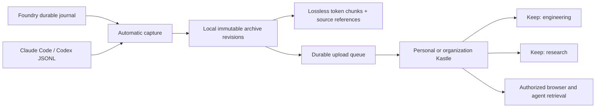

# Session archives

Foundry captures recorded work locally without calling a model. Kingdom hosts selected archives under a personal or organization Kastle. A session may appear in multiple Keeps in that Kastle. Categorization suggests labels; it never grants access.



## Local capture

Starting a Foundry viewer with its durable session store schedules existing journal threads for capture, then captures changes after journal events. The archive database lives at `<configDir>/archives/archives.sqlite` (`.foundry/archives/archives.sqlite` by default). This does not start agents or make inference calls. A viewer without a durable journal has no automatic archive capture.

The local viewer exposes:

- `GET /api/archives`: archive metadata, capture errors, publication errors.
- `GET /api/archives/:id`: latest snapshot and chunks.
- `POST /api/archives/search`: `{ids, query, budget}`; budget is per archive locally.
- `POST /api/archives/capture`: retry journal capture.

The local viewer's existing authentication applies. A local archive does not become shared merely because it was captured.

## Import old sessions

From the Foundry repository, using Bun:

```sh
bun run archive preview --directory /absolute/path/history --source codex --limit 100
bun run archive import --file /absolute/path/session.jsonl --source codex --project-id my-project
bun run archive import --file /absolute/path/session.jsonl --source claude-code --project-id my-project
bun run archive list
bun run archive search --id ARCHIVE_ID --query 'schema migration'
bun run archive export --id ARCHIVE_ID > session.archive.json
```

Preview recursively inventories JSONL files under the explicit directory, reports importable sessions and rejected files, and ignores symlinks. It does not create an archive store or upload anything. `--file` previews one transcript; `--limit` bounds a directory preview (default 100, maximum 1000), and `truncated` reports an incomplete inventory.

Use `--store /absolute/path/archives.sqlite` to select the store. Each store maintains a stable source UUID; back it up with the archive database. Reimport into the same store updates the same source session rather than inventing another identity. Changing imported content creates a new revision. Malformed JSON, conflicting duplicate records, or mixed session identities reject the import. `--session-id` can supply an ID when an export lacks it. `--title` sets a human-readable title; automatic titles skip recognized generated setup blocks.

Imports stream individual JSONL files up to 1 GB, with at most 64 million characters in a raw record; normalized snapshots are limited to 64 MB, 50,000 records, and 2 million characters per entry. Oversized sessions fail explicitly and remain in their source file. Directory watching for external CLI history is not implemented. Foundry journal capture is automatic; historical CLI import is explicit.

## Publish to Kingdom

Create the destination Kastle and register a runtime for a user who currently manages it. Put its `kastle_runtime_…` credential in an environment variable available to Foundry. Credential setup uses Kingdom's existing runtime enrollment; archive config stores an environment variable name, never the secret.

`<configDir>/archives.json` is an array:

```json
[
  {
    "projectId": "my-project",
    "url": "https://kingdom.example/",
    "kastleId": "11111111-1111-4111-8111-111111111111",
    "keepIds": ["22222222-2222-4222-8222-222222222222"],
    "tokenEnv": "KINGDOM_ARCHIVE_TOKEN"
  }
]
```

Use real IDs. Only archives whose explicit local `projectId` matches a destination are uploaded. Multiple destinations are explicit separate copies, with independent ownership and shares. Destination Keeps must belong to that destination Kastle. Restart Foundry to load changed configuration. All archived text, including recorded tool results and phase request context, goes to the selected destination; there is no automatic secret scrubber.

For one imported archive, save one destination object (without the outer array) and run:

```sh
bun run archive publish --id ARCHIVE_ID --destination /absolute/path/destination.json
```

The automatic publisher also checks imported archives already in the same store on startup. It retains immutable local versions, persists the pending upload before sending, and replays that exact version when an acknowledgment is lost. Failed automatic uploads retry every 30 seconds. Uploaded changes use a previous-digest check, so a conflicting remote revision returns 409 and is not silently overwritten. Inspect both histories before resolving such a conflict. Only HTTPS and loopback HTTP are accepted; redirects are refused. Keep placement can change without creating a content revision.

## Feed archives into Foundry context

Add an enabled `archive` source to Foundry's existing source configuration, then attach it to a layer used by the relevant agents:

```json
{
  "id": "session-history",
  "type": "archive",
  "label": "Session history",
  "uri": "https://kingdom.example/",
  "enabled": true,
  "archive": {
    "projectId": "my-project",
    "kastleId": "11111111-1111-4111-8111-111111111111",
    "keepId": "22222222-2222-4222-8222-222222222222",
    "tokenEnv": "KINGDOM_ARCHIVE_TOKEN",
    "budget": 2048
  }
}
```

The layer's `sourceIds` contains `session-history`. Its prompt should describe this as historical evidence to assess, not current instructions. Retrieval uses the current focus, checks the runtime credential and Kastle access on each source load, and only loads for the configured local project. Returned records include archive ID, revision, digest, entry ID, source reference, and exact character offsets. The serialized context wrapper is included in its token budget. Previously delivered content cannot be recalled from an agent's conversation when a share is revoked.

## Fidelity and current scope

- Capture retains recorded user/assistant messages, turn outcomes, public native text observations with delta/snapshot form, public tool evidence, and phase events. Recorded phase request context is included. Central injected context, raw checkpoint traces and private reasoning are not reconstructed.
- Claude/Codex imports include supported public text and tool records. Public reasoning summaries are included only when present in the export. Images, encrypted payloads, private thinking and unsupported records are omitted and coverage reports this.
- Tokenization uses `cl100k_base` as a named reference encoding. These counts are not interchangeable with every model's billing or context accounting. Chunks preserve text; they are not summaries or compression. Search is lexical, with no paid embedding or categorization service.
- Oracle `goalIds`/`runIds` can be supplied in the portable snapshot and survive storage and retrieval. This does not implement Oracle scheduling, goal ownership, or automatic discovery of Oracle relationships.
- Kingdom currently provides explicit user read shares for a session and all its revisions. Keeps are overlapping groupings within a Kastle, not independent grants. Archive shares are not yet resources in the external-connection Signet system.


## Standalone Archive integration (2026-09-20)

The portable implementation now lives in the sibling `archive` repository under MIT. Foundry installs it from npm under its existing `@inixiative/session-archive` import name (`npm:@inixiative/archive@^0.2.1`), the same alias Kingdom uses. Foundry retains journal capture and viewer wiring. 

Direct BYO connection:

```sh
bun run archive connect --url https://your-archive.example --project-id my-project --token-env ARCHIVE_TOKEN
```

Kingdom connection:

```sh
bun run archive connect --kind kingdom --url https://kingdom.example --kastle-id UUID --project-id my-project --token-env KINGDOM_ARCHIVE_TOKEN
```

The commands verify access and save `.foundry/archives.json`; `routes` previews publishing, and `sync` publishes matching local archives. The durable viewer loads this same configuration. Put credentials in its environment and restart after configuration changes. Exact-project external collection is available through `collect --directory HISTORY --source codex --project-root EXACT_CWD --project-id my-project --watch`. Use `claude-code` for Claude.

For direct context retrieval set `archive.kind` to `archive`, omit `kastleId`/`keepId`, and retain `projectId`, `tokenEnv`, and `budget`. For Kingdom, the existing config is unchanged. Standalone tokens and Kingdom runtime credentials are distinct; tags do not grant access or select a destination.

## Connection controls and Archive console

Settings → Archives lists configured destinations and checks their access. Connect Archive validates the URL and named credential environment variable before saving, reloads routing immediately, and queues matching local records. Retrieve context previews the same project-scoped, token-budgeted evidence used by `ArchiveContextSource`. It accepts only an already configured destination.

For capture/browsing without model workers, run `bun run archive:viewer` in a configured project, or invoke `packages/foundry/src/archives/viewer.ts` with that project as the working directory. `FOUNDRY_CONFIG_DIR` optionally selects the configuration directory; `VIEWER_PORT` defaults to 4400. The console uses the normal viewer, durable journal, automatic archive capture and publisher. It does not run model agents. The normal `bun run start` worker launcher still requires its configured decision-model credentials.

The compatibility facade now uses the published `@inixiative/archive@0.2.1` npm package, including ChatGPT partial-text imports and exact hosted tag filtering. Direct Archive sources support `kind: "archive"` without a Kastle ID. Use the explicit project ID consistently in journal metadata, destination configuration and retrieval configuration.

## Foundry credentials

In **Settings → Archives**, choose **Foundry managed credential** for a direct Archive server. Enter the Archive URL, local project ID and access token once. Foundry verifies access before saving the connection. The connection and context-source settings contain only `{ "type": "managed", "id": "<UUID>" }`; the secret lives in an owned `0600` file under `.foundry/credentials/` (`0700` directory), using the same private-file custody as native runtime enrollment. This is private local storage, not an encrypted OS keychain. Resolution checks the service, normalized destination URL, project and optional Kastle and reads the file afresh for each request. Environment-variable connections remain supported.

Core exports `CredentialReference`, `CredentialScope` and `CredentialResolver`. Foundry supplies the resolver; standalone Archive has no dependency on Foundry Core or enrollment. Inference provider keys and native Claude/Codex subscription credentials are not Archive credentials.

For **Connected Kingdom identity**, first connect in **Settings → Kingdom**. Archive discovers the enrolled Kastle and its configured hosted destinations. Choose a destination or Kingdom-stored archives. Requests reuse Foundry's existing installation credential and stay on the enrolled Kingdom origin. Kingdom checks current installation validity and Kastle authority for every request; hosted-server tokens remain on Kingdom. An external destination must have an explicit matching `projectId` in `ARCHIVE_REMOTE_BINDINGS` to accept publication. External archives do not support Kingdom Keeps or per-session shares.

A direct project source can use the same credential reference:

```json
{
  "id": "archive-history",
  "type": "archive",
  "uri": "https://archive.example/",
  "enabled": true,
  "archive": {
    "kind": "archive",
    "projectId": "personal",
    "credential": { "type": "managed", "id": "<saved-credential-UUID>" },
    "budget": 2048
  }
}
```

For a Kingdom source use its API origin as `uri`, `kind: "kingdom"`, the enrolled `kastleId`, optional hosted `connectionId`, and `credential: { "type": "kingdom-runtime" }`. The owning local project must still match before any context request is sent. Reconnect a direct destination to replace its credential; update source references that also use the old credential. Old references are not silently redirected to a new secret.

The Foundry CLI uses the same resolver for sync, publish and remote search:

```sh
bun run archive connect --kingdom-identity --connection-id my-archive --project-id my-project
bun run archive sync
bun run archive search --remote --query "migration"
```

For a saved direct credential use `connect --kind archive --url https://archive.example --project-id personal --credential-id <UUID>`. Secrets are never CLI arguments. `--config` selects the connection file and its parent Foundry credential directory; otherwise `FOUNDRY_CONFIG_DIR` or `.foundry` is used. Standalone Archive's own CLI keeps its independent environment-token setup.
