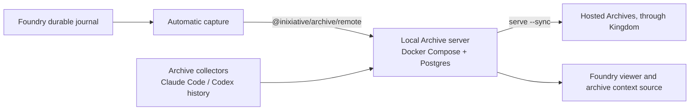

# Session archives

Foundry captures recorded work into this machine's local Archive (`@inixiative/archive`) without calling a model. Foundry keeps no archive store of its own and publishes nowhere: the local Archive server holds the database, and it publishes onward to hosted Archives itself. Hosted Archives are reached through Kingdom as an integration. Categorization suggests labels; it never grants access.


```mermaid
flowchart LR
  J[Foundry durable journal] --> C[Automatic capture]
  C -- "@inixiative/archive/remote" --> L[Local Archive server<br/>Docker Compose + Postgres]
  X[Archive collectors<br/>Claude Code / Codex history] --> L
  L -- "serve --sync" --> H[Hosted Archives, through Kingdom]
  L --> R[Foundry viewer and archive context source]
```

## Set up the local Archive

One Archive runs per machine, in Docker Compose (`archive up`). From the Foundry repository:

```sh
bun run archive setup         # starts the local Archive if it is not answering, then checks it; --yes skips the prompt
bun run doctor                # includes the local Archive: not-set-up | unverified | reachable | unreachable
```

`archive setup` runs the Archive CLI's `up` in a subprocess: it creates the token at `~/.local/share/archive/server.token`, then starts the bundled Compose file (the Archive and its Postgres, HTTP on `127.0.0.1:4700`). Docker must be running. Settings → Archives shows the same status, a **Set up an Archive** button that does the same thing, and the Archive's integrations (read-only; the Archive owns them). `bun run setup` offers it on first run and as the **Kingdom & archives** menu item, along with Kingdom pairing.

Foundry finds the local Archive the way every Archive client does (`localArchive()`): `ARCHIVE_URL` or `http://127.0.0.1:4700`, with the token from `ARCHIVE_TOKEN` or `server.token`. Foundry never imports the Archive CLI or server, which bind their own Prisma client; it spawns the CLI.

## Local capture

Starting a Foundry viewer with its durable session store schedules existing journal threads for capture, then captures changes after journal events. This does not start agents or make inference calls. A viewer without a durable journal has no automatic archive capture.

The journal is the source of truth. When the local Archive is not set up or does not answer, the thread's capture error is recorded and capture retries every 30 seconds; once an Archive appears (even one started from a terminal while Foundry runs), the next retry captures every waiting thread. Each capture is a whole-thread snapshot, so re-capturing is safe. Thread context (linked PRs and tickets) is derived from each snapshot as it is built, whether or not the Archive accepted it.

The local viewer exposes:

- `GET /api/archives/status`: `{ configured, reachable, url, integrations? }`.
- `POST /api/archives/setup`: starts the local Archive when it is not answering, then returns its status (502 with `error` when `archive up` fails).
- `GET /api/archives`: the local Archive's listings, per-thread capture errors and its status.
- `GET /api/archives/:id`: latest snapshot and chunks.
- `POST /api/archives/search`: `{ query, projectId?, budget?, limit? }`, passed to the Archive's search.
- `POST /api/archives/capture`: recapture every journal thread now.

The local viewer's existing authentication applies.

## Archive commands

Every `bun run archive` command except `setup` is the Archive CLI, run with your arguments:

```sh
bun run archive preview --directory /absolute/path/history --source codex --limit 100
bun run archive import --file /absolute/path/session.jsonl --source codex --project-id my-project
bun run archive collect --directory ~/.claude/projects --source claude-code --project-root /exact/cwd --project-id my-project --watch
bun run archive list
bun run archive search --query 'schema migration'
bun run archive export --id ARCHIVE_ID > session.archive.json
```

See the Archive README for collectors (`archive agents`), tags, references, retention and the onward publication the local Archive runs (`serve --sync`).

## Kingdom pairing

A Foundry can be paired with many Kingdoms, and a Kingdom with many Foundries:

```sh
bun run kingdom pair --url https://kingdom-prod-api-prod.up.railway.app   # prints the approval URL + code, opens it on macOS
bun run kingdom pair --url https://other-kingdom.example                   # adds a second Kingdom; the first is untouched
bun run kingdom status        # every paired Kingdom: connected | unavailable (one heartbeat each)
bun run kingdom disconnect --kingdom ID|URL   # deletes that Kingdom's local credential; revoke the runtime there too
```

`kingdom pair` is the terminal form of Settings → Kingdom: same device-code flow, same `<configDir>/kingdom-runtime-<installationId>.json` (0600), polled at Kingdom's interval and checked with one heartbeat. The heartbeat names the owner Kingdom approved the runtime for; the pairing is recorded in the `kingdomRuntimes` setting as `{ url, owner, installationId, credentialFile }`. Each Kingdom API origin + owner pairs once, and its id (printed by `pair` and `status`) is derived from them, so it survives re-pairing. Pairing the same Kingdom as the same owner again is refused after approval (revoke that new runtime in Kingdom); `--replace` re-pairs one paired Kingdom instead, chosen by `--kingdom ID|URL` or `--url`, or the only one, and approval must come from the same owner. `disconnect` needs `--kingdom` when several are paired. Without `--url` pairing uses `KINGDOM_URL`, then hosted production; `--no-open` skips the browser; `--config-dir` defaults to `FOUNDRY_CONFIG_DIR` or `.foundry`.

Each paired Kingdom has its own heartbeat and job worker. A job is polled from, run for and reported to the Kingdom that issued it; its private state lives under `runtime-jobs/<installationId>_<jobId>`. A finished job is recorded in the local Archive before it is reported; with no local Archive set up the record is skipped. One Kingdom refusing or unreachable never stops another. The viewer stays unlocked while at least one paired Kingdom authorizes this Foundry. A running viewer holds settings in memory: the CLIs report `restartViewer: true` when one answers on `VIEWER_PORT`, and `bun run daemon:start` restarts the daemon.

Hosted Archives connect through Kingdom as an integration; the local Archive publishes to them. Foundry does not hold hosted Archive credentials or destinations.

## Feed archives into Foundry context

Add an enabled `archive` source to Foundry's source configuration, then attach it to a layer used by the relevant agents:

```json
{
  "id": "session-history",
  "type": "archive",
  "label": "Session history",
  "uri": "",
  "enabled": true,
  "archive": { "projectId": "my-project", "budget": 2048 }
}
```

The layer's `sourceIds` contains `session-history`. Its prompt should describe this as historical evidence to assess, not current instructions. Retrieval searches the local Archive with the current focus and only loads for the configured local project; with no local Archive set up it returns nothing. Returned records include archive ID, revision, digest, entry ID, source reference and exact character offsets. The serialized context wrapper is included in its token budget.

## Archive console

For capture and browsing without model workers, run `bun run archive:viewer` in a configured project, or invoke `packages/foundry/src/archives/viewer.ts` with that project as the working directory. `FOUNDRY_CONFIG_DIR` optionally selects the configuration directory; `VIEWER_PORT` defaults to 4500. The console uses the normal viewer, durable journal and automatic archive capture. It does not run model agents.

## Fidelity and current scope

- Capture retains recorded user/assistant messages, turn outcomes, public native text observations with delta/snapshot form, public tool evidence, and phase events. Recorded phase request context is included. Central injected context, raw checkpoint traces and private reasoning are not reconstructed.
- Entries carry Archive's `model` and `effort` from what Foundry recorded running: the executor's answers and tool calls from its native configuration (observed over requested), decision phases (route, advice, guard outcome) from the `served` model each role's request records. A phase whose participants ran on different models carries none. Each snapshot's `actor` is the local account operating Foundry (`kind: 'user'`).
- All archived text, including recorded tool results and phase request context, goes to the local Archive and from there to whatever it publishes to; there is no automatic secret scrubber.
- Oracle `goalIds`/`runIds` can be supplied in the portable snapshot and survive storage and retrieval. This does not implement Oracle scheduling, goal ownership, or automatic discovery of Oracle relationships.
