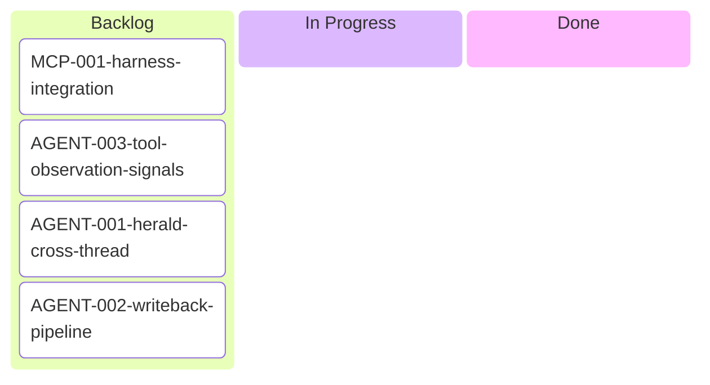

# Foundry Backlog

## Tickets

### Backlog — Last-Mile Wiring

These tickets capture the connections between components that are individually built but not yet wired together. Each loop in FLOW.md has its pieces at 80-90% — the remaining 10-20% is the wiring between them.

| Ticket | Loop | Gap | Priority |
|--------|------|-----|----------|
| [MCP-001](./MCP-001-harness-integration.md) | Loop 2 | MCP runs standalone, not alongside live harness | High |
| [AGENT-003](./AGENT-003-tool-observation-signals.md) | Loop 3 | Hook script generated but not written to disk; no callback endpoint | High |
| [AGENT-002](./AGENT-002-writeback-pipeline.md) | Loop 4 | CorpusCompiler pipeline works but Librarian doesn't feed it | Medium |
| [AGENT-001](./AGENT-001-herald-cross-thread.md) | Cross-thread | Herald class exists but isn't instantiated | Medium |

---

_Last updated: 2026-04-09_
